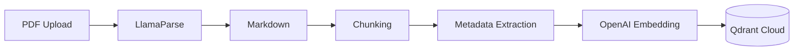
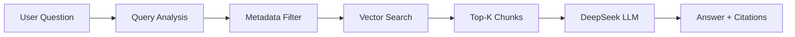

# AI Engine - RAG Chatbot Architecture

Tài liệu kỹ thuật cho hệ thống RAG Chatbot tư vấn kỹ thuật ngành Dầu khí/Năng lượng.

## Mục lục

- [Tổng quan](#tổng-quan)
- [Kiến trúc hệ thống](#kiến-trúc-hệ-thống)
- [Components](#components)
- [Data Flow](#data-flow)
- [Tech Stack](#tech-stack)

---

## Tổng quan

AI Engine là Python service xử lý RAG (Retrieval-Augmented Generation) cho việc tra cứu tài liệu kỹ thuật. Hệ thống được thiết kế để:

- **Đọc hiểu PDF kỹ thuật** (Datasheets, Catalogs, Manuals)
- **Trích xuất bảng biểu** chính xác với LlamaParse
- **Trả lời kèm trích dẫn** nguồn cụ thể
- **Hỗ trợ song ngữ** (Tiếng Việt/English)

---

## Kiến trúc hệ thống

```
┌─────────────────────────────────────────────────────────────────┐
│                         INTERNET                                │
└───────────────────────────┬─────────────────────────────────────┘
                            │
      ┌─────────────────────┼─────────────────────┐
      ▼                     ▼                     ▼
┌─────────────┐     ┌─────────────┐       ┌─────────────┐
│   Web       │     │   Backend   │       │  AI Engine  │
│  Next.js    │────▶│   NestJS    │──────▶│   Python    │
│   :4000     │     │    :4002    │       │    :4003    │
└─────────────┘     └─────────────┘       └──────┬──────┘
                                                 │
                    ┌────────────────────────────┼────────────────┐
                    ▼                            ▼                ▼
              ┌──────────┐               ┌──────────┐      ┌──────────┐
              │  Qdrant  │               │ DeepSeek │      │LlamaParse│
              │  Cloud   │               │   LLM    │      │   API    │
              └──────────┘               └──────────┘      └──────────┘
```

---

## Components

### 1. RAG Engine (`src/core/rag_engine.py`)

Core engine xử lý query và retrieval.

| Chức năng | Mô tả |
|-----------|-------|
| `query()` | Truy vấn knowledge base, trả về answer + citations |
| `add_documents()` | Thêm documents vào vector store |
| `health_check()` | Kiểm tra kết nối Qdrant, LLM |

**LLM Configuration:**
- Model: DeepSeek Chat (OpenAI-compatible API)
- Temperature: 0.1 (low for factual responses)
- Prompt: Chain-of-Thought cho technical reasoning

### 2. PDF Processor (`src/ingestion/pdf_processor.py`)

Xử lý PDF với LlamaParse.

| Chức năng | Mô tả |
|-----------|-------|
| `process_file()` | Parse PDF → Markdown → Nodes |
| `process_bytes()` | Process từ bytes (upload) |

**Parsing Features:**
- Giữ nguyên cấu trúc bảng
- Trích xuất thông số kỹ thuật
- Detect document type (datasheet, catalog, manual)

### 3. Metadata Extractor (`src/ingestion/metadata_extractor.py`)

Trích xuất metadata kỹ thuật từ content.

**Schema:**
```python
{
    "brand": "str",           # Fisher, Bettis, Keystone
    "product_series": "str",  # HP Series, E Series
    "product_type": "str",    # Control Valve, Ball Valve
    "pressure_class": "list", # [CL150, CL300, CL600]
    "connection_type": "str", # Flanged, Threaded
    "application": "list",    # [Oil & Gas, Power]
}
```

### 4. Google Drive Sync (`src/ingestion/gdrive_sync.py`)

Đồng bộ tài liệu từ Google Drive.

| Chức năng | Mô tả |
|-----------|-------|
| `list_files()` | Liệt kê PDF files trong folder |
| `download_file()` | Download file theo ID |
| `sync_new_files()` | Sync files mới/modified |

---

## Data Flow

### Ingestion Pipeline



### Query Pipeline



---

## Tech Stack

| Component | Technology | Lý do chọn |
|-----------|------------|------------|
| **Framework** | FastAPI | High performance, async native |
| **RAG** | LlamaIndex | Best data-first RAG framework |
| **Vector DB** | Qdrant Cloud | Free tier tốt, Metadata filtering |
| **LLM** | DeepSeek | Cost-effective, good reasoning |
| **Embedding** | OpenAI text-embedding-3-small | Best price/performance |
| **PDF Parser** | LlamaParse | Table-aware parsing |

---

## Configuration

Xem [.env.example](file:///Users/khuong/Khuong-D/TDH/toanthang/apps/ai-engine/.env.example) để biết các environment variables cần thiết.

### Key Settings

```python
# RAG Configuration
RETRIEVAL_TOP_K=15      # Initial retrieval count
RERANK_TOP_N=5          # After reranking
CHUNK_SIZE=1024         # Chunk size in characters
CHUNK_OVERLAP=200       # Overlap between chunks

# LLM Configuration
LLM_MODEL=deepseek-chat
LLM_TEMPERATURE=0.1     # Low for factual answers
```
