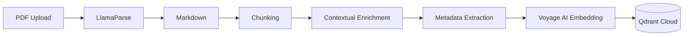
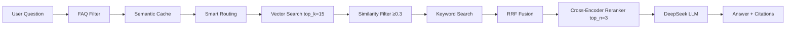

# AI Engine - RAG Chatbot Architecture

Tài liệu kỹ thuật cho hệ thống RAG Chatbot tư vấn kỹ thuật ngành Dầu khí/Năng lượng.

## Mục lục

- [Tổng quan](#tổng-quan)
- [Kiến trúc hệ thống](#kiến-trúc-hệ-thống)
- [Components](#components)
- [Data Flow](#data-flow)
- [Tech Stack](#tech-stack)

---

## Tổng quan

AI Engine là Python service xử lý RAG (Retrieval-Augmented Generation) cho việc tra cứu tài liệu kỹ thuật. Hệ thống được thiết kế để:

- **Đọc hiểu PDF kỹ thuật** (Datasheets, Catalogs, Manuals)
- **Trích xuất bảng biểu** chính xác với LlamaParse
- **Trả lời kèm trích dẫn** nguồn cụ thể
- **Hỗ trợ song ngữ** (Tiếng Việt/English)

---

## Kiến trúc hệ thống

```
┌─────────────────────────────────────────────────────────────────┐
│                         INTERNET                                │
└───────────────────────────┬─────────────────────────────────────┘
                            │
      ┌─────────────────────┼─────────────────────┐
      ▼                     ▼                     ▼
┌─────────────┐     ┌─────────────┐       ┌─────────────┐
│   Web       │     │   Backend   │       │  AI Engine  │
│  Next.js    │────▶│   NestJS    │──────▶│   Python    │
│   :4000     │     │    :4002    │       │    :4003    │
└─────────────┘     └─────────────┘       └──────┬──────┘
                                                 │
                    ┌────────────────────────────┼────────────────┐
                    ▼                            ▼                ▼
              ┌──────────┐               ┌──────────┐      ┌──────────┐
              │  Qdrant  │               │ DeepSeek │      │LlamaParse│
              │  Cloud   │               │   LLM    │      │   API    │
              └──────────┘               └──────────┘      └──────────┘
```

---

## Components

### 1. RAG Engine (`src/core/rag_engine.py`)

Core engine xử lý query và retrieval.

| Chức năng | Mô tả |
|-----------|-------|
| `query()` | Truy vấn knowledge base, trả về answer + citations |
| `add_documents()` | Thêm documents vào vector store |
| `health_check()` | Kiểm tra kết nối Qdrant, LLM |

**LLM Configuration:**
- Model: DeepSeek Chat (OpenAI-compatible API)
- Temperature: 0.1 (low for factual responses)
- Prompt: Chain-of-Thought cho technical reasoning

### 2. PDF Processor (`src/ingestion/pdf_processor.py`)

Xử lý PDF với LlamaParse + Contextual Enrichment.

| Chức năng | Mô tả |
|-----------|-------|
| `process_file()` | Parse PDF → Markdown → Nodes → Contextual Enrichment |
| `process_bytes()` | Process từ bytes (upload) |

**Parsing Features:**
- Giữ nguyên cấu trúc bảng
- Trích xuất thông số kỹ thuật
- Detect document type (datasheet, catalog, manual)
- **Contextual Enrichment**: Tự động sinh ngữ cảnh cho mỗi chunk từ toàn bộ tài liệu

### 2b. Contextual Enricher (`src/ingestion/contextual_enricher.py`)

Implement Anthropic's Contextual Retrieval technique.

| Chức năng | Mô tả |
|-----------|-------|
| `enrich_chunks()` | Sinh context cho từng chunk bằng LLM, prepend vào text |

**Ví dụ trước/sau enrichment:**
- **Trước:** `"Pressure rating: CL150-CL2500. Body material: WCB, CF8M..."`
- **Sau:** `"[Context: Đoạn này từ datasheet Fisher easy-e ET valve, mô tả thông số kỹ thuật pressure rating và body material.]\n\nPressure rating: CL150-CL2500. Body material: WCB, CF8M..."`

### 2c. Keyword Retriever (`src/retrieval/keyword_retriever.py`)

Keyword search sử dụng Qdrant full-text search, kết hợp với vector search qua RRF fusion.

| Chức năng | Mô tả |
|-----------|-------|
| `QdrantKeywordRetriever.retrieve()` | Full-text search trên Qdrant |
| `fuse_results()` | Reciprocal Rank Fusion kết hợp vector + keyword |

### 3. Metadata Extractor (`src/ingestion/metadata_extractor.py`)

Trích xuất metadata kỹ thuật từ content.

**Schema:**
```python
{
    "brand": "str",           # Fisher, Bettis, Keystone
    "product_series": "str",  # HP Series, E Series
    "product_type": "str",    # Control Valve, Ball Valve
    "pressure_class": "list", # [CL150, CL300, CL600]
    "connection_type": "str", # Flanged, Threaded
    "application": "list",    # [Oil & Gas, Power]
}
```

### 4. Google Drive Sync (`src/ingestion/gdrive_sync.py`)

Đồng bộ tài liệu từ Google Drive.

| Chức năng | Mô tả |
|-----------|-------|
| `list_files()` | Liệt kê PDF files trong folder |
| `download_file()` | Download file theo ID |
| `sync_new_files()` | Sync files mới/modified |

---

## Data Flow

### Ingestion Pipeline



**Contextual Enrichment (Anthropic's Contextual Retrieval):**
- Dùng LLM sinh 1-2 câu context cho mỗi chunk dựa trên toàn bộ tài liệu
- Prepend context vào chunk text TRƯỚC khi embedding
- Giảm ~49% lỗi retrieval (chunk không còn mất ngữ cảnh)
- `original_text` được lưu trong metadata để citation hiển thị đúng

### Query Pipeline



**Hybrid Retrieval Pipeline:**
- **Vector Search** (top_k=15): Semantic search qua Voyage AI embeddings
- **Keyword Search**: Qdrant full-text search cho exact match (model numbers: DVC6200, MR95...)
- **RRF Fusion**: Reciprocal Rank Fusion kết hợp kết quả vector + keyword
- **Cross-Encoder Reranker**: `ms-marco-MiniLM-L-6-v2` lọc top 3 chính xác nhất

---

## Tech Stack

| Component | Technology | Lý do chọn |
|-----------|------------|------------|
| **Framework** | FastAPI | High performance, async native |
| **RAG** | LlamaIndex | Best data-first RAG framework |
| **Vector DB** | Qdrant Cloud | Free tier tốt, Metadata filtering |
| **LLM** | DeepSeek | Cost-effective, good reasoning |
| **Embedding** | Voyage AI voyage-3.5-lite | 60% cheaper than OpenAI |
| **Reranker** | cross-encoder/ms-marco-MiniLM-L-6-v2 | Local, free, ~80MB |
| **PDF Parser** | LlamaParse | Table-aware parsing |

---

## Configuration

Xem [.env.example](file:///Users/khuong/Khuong-D/TDH/toanthang/apps/ai-engine/.env.example) để biết các environment variables cần thiết.

### Key Settings

```python
# RAG Configuration
RETRIEVAL_TOP_K=15      # Initial retrieval count (wider recall for reranking)
RERANK_ENABLED=true     # Cross-encoder reranking
RERANK_MODEL=cross-encoder/ms-marco-MiniLM-L-6-v2
RERANK_TOP_N=3          # Final count after reranking
CHUNK_SIZE=1024         # Chunk size in characters
CHUNK_OVERLAP=200       # Overlap between chunks

# Contextual Enrichment (Anthropic's Contextual Retrieval)
CONTEXTUAL_ENRICHMENT_ENABLED=true
CONTEXTUAL_ENRICHMENT_MAX_DOC_LENGTH=6000
CONTEXTUAL_ENRICHMENT_BATCH_SIZE=5

# Hybrid Search (Vector + Keyword)
HYBRID_SEARCH_ENABLED=true
HYBRID_VECTOR_WEIGHT=0.7   # 70% vector, 30% keyword

# LLM Configuration
LLM_MODEL=deepseek-chat
LLM_TEMPERATURE=0.1     # Low for factual answers
```
