# TTE Chatbot — Mermaid Diagrams

> Trực quan hóa kiến trúc và luồng xử lý của hệ thống chatbot TTE.

---

## Muc luc

1. [Kien truc he thong tong the](#1-kien-truc-he-thong-tong-the)
2. [Luong xu ly Chat Request](#2-luong-xu-ly-chat-request)
3. [RAG Query Processing Pipeline](#3-rag-query-processing-pipeline)
4. [FAQ Pre-filter Logic](#4-faq-pre-filter-logic)
5. [Semantic Cache](#5-semantic-cache)
6. [Smart Model Router](#6-smart-model-router)
7. [LLM Fallback Chain](#7-llm-fallback-chain)
8. [Security Guards Flow](#8-security-guards-flow)
9. [Session va Cache Management](#9-session-va-cache-management)
10. [Document Ingestion Flow](#10-document-ingestion-flow)
11. [Google Drive Sync Flow](#11-google-drive-sync-flow)
12. [Startup Sequence](#12-startup-sequence)
13. [Deployment Topology](#13-deployment-topology)
14. [Component Dependencies](#14-component-dependencies)
15. [Redis Key Lifecycle](#15-redis-key-lifecycle)

---

## 1. Kien truc he thong tong the

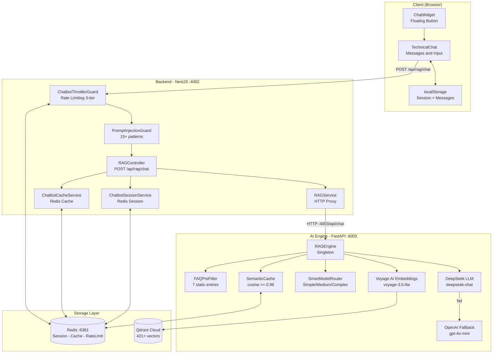

---

## 2. Luong xu ly Chat Request

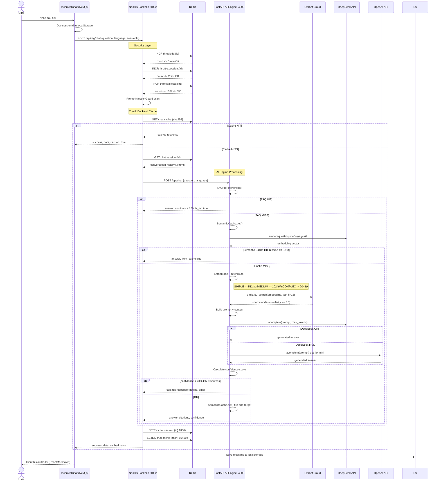

---

## 3. RAG Query Processing Pipeline

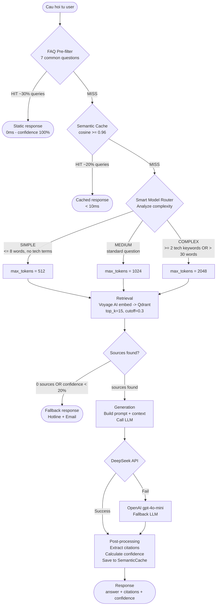

---

## 4. FAQ Pre-filter Logic

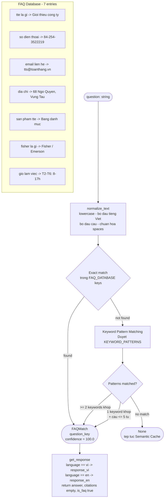

---

## 5. Semantic Cache

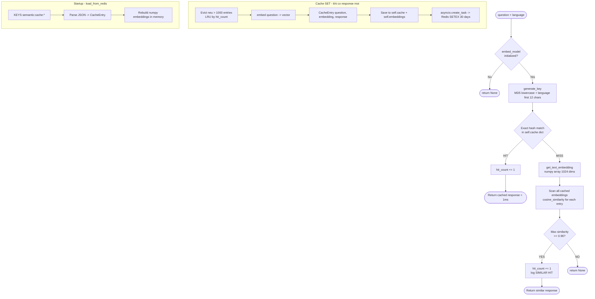

---

## 6. Smart Model Router

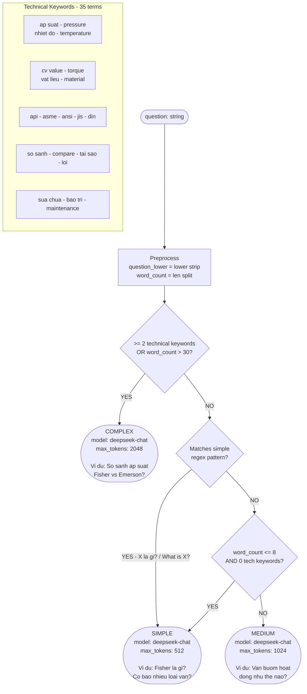

---

## 7. LLM Fallback Chain

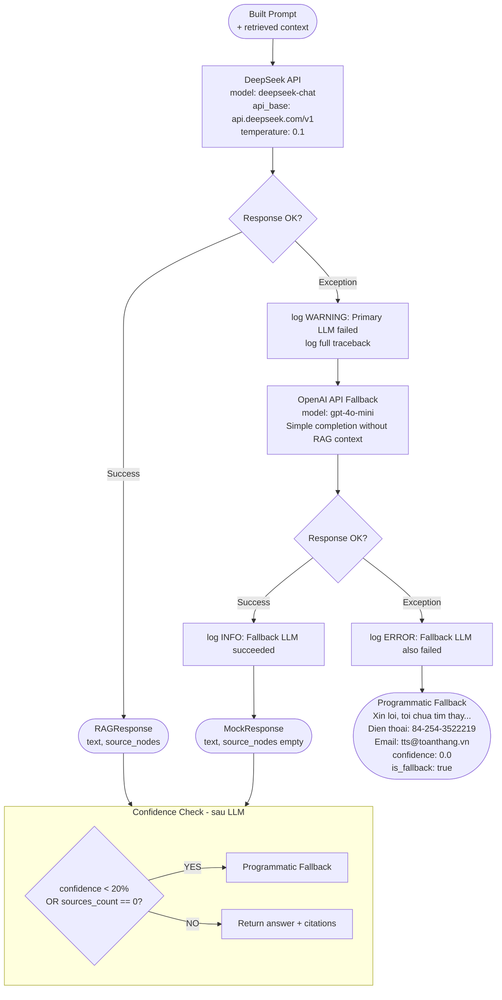

---

## 8. Security Guards Flow

```mermaid
flowchart TD
    REQ([Incoming Request\nPOST /api/rag/chat]) --> G1

    subgraph G1_BOX["Guard 1: ChatbotThrottlerGuard"]
        G1[Extract identifiers\nip = X-Forwarded-For or req.ip\nsessionId = body.sessionId or anonymous]

        G1 --> IP_CHK

        IP_CHK[Redis INCR throttle:ip:{ip}\nEXPIRE 60s on first hit]
        IP_CHK --> IP_LIMIT{count > 5/min?}
        IP_LIMIT -- "YES" --> R429_IP([HTTP 429 Too Many Requests IP\nretryAfter: TTL remaining])
        IP_LIMIT -- "NO" --> SESS_CHK

        SESS_CHK[Redis INCR throttle:session:{id}\nEXPIRE 3600s on first hit]
        SESS_CHK --> SESS_LIMIT{count > 20/hr?}
        SESS_LIMIT -- "YES" --> R429_S([HTTP 429 Rate limit Session])
        SESS_LIMIT -- "NO" --> GLOB_CHK

        GLOB_CHK[Redis INCR throttle:global:chat\nEXPIRE 60s on first hit]
        GLOB_CHK --> GLOB_LIMIT{count > 100/min?}
        GLOB_LIMIT -- "YES" --> R429_G([HTTP 429 Rate limit Global])
        GLOB_LIMIT -- "NO" --> G1_PASS([Pass])
    end

    G1_PASS --> G2_BOX

    subgraph G2_BOX["Guard 2: PromptInjectionGuard"]
        G2[question = request.body.question]
        G2 --> WL_CHK

        WL_CHK{Whitelist match?\ntechnical terms}
        WL_CHK -- "YES" --> G2_PASS([Pass])
        WL_CHK -- "NO" --> INJ_CHK

        INJ_CHK[Scan 15+ regex patterns\nignore previous instructions\nreveal system prompt\nyou are now...\njailbreak / DAN mode\ndeveloper mode]

        INJ_CHK --> INJ_FOUND{Pattern matched?}
        INJ_FOUND -- "YES" --> R400([HTTP 400 Bad Request\nInvalid input\nlog WARN: blocked])
        INJ_FOUND -- "NO" --> G2_PASS
    end

    G2_PASS --> CTRL

    subgraph CTRL["RAGController Validation"]
        V1{question\nempty?}
        V1 -- "YES" --> R400_E([HTTP 400\nQuestion required])
        V1 -- "NO" --> V2
        V2{length >\n500 chars?}
        V2 -- "YES" --> R400_L([HTTP 400\nQuestion too long])
        V2 -- "NO" --> PROCEED([Proceed to\nbusiness logic])
    end
```

---

## 9. Session va Cache Management

```mermaid
flowchart TD
    subgraph SESSION["ChatbotSessionService"]
        direction TB
        SQ([saveMessage called]) --> SG

        SG[GET chat:session:{id}\nParse JSON -> ChatSession]

        SG --> SE{Session\nexists?}
        SE -- "NO" --> SC_NEW[Create new session\nsessionId - history empty - createdAt - lastActiveAt]
        SE -- "YES" --> SC_EXIST[Use existing session]

        SC_NEW & SC_EXIST --> SADD[history.push message]

        SADD --> TRIM{history.length > maxTurns x 2\n6 messages?}
        TRIM -- "YES" --> SLICE[history = history.slice minus 6]
        TRIM -- "NO" --> SAVE

        SLICE --> SAVE

        SAVE[SETEX chat:session:{id}\nTTL: 1800s 30 min\nJSON.stringify session]

        SAVE --> DONE([Saved])
    end

    subgraph CACHE["ChatbotCacheService"]
        direction TB
        CQ([getCachedResponse called]) --> ENABLED

        ENABLED{CHATBOT_CACHE\n_ENABLED?}
        ENABLED -- "false" --> CNULL([return null])
        ENABLED -- "true" --> CNORM

        CNORM[normalizeQuestion\nlowercase - trim spaces - strip punctuation]

        CNORM --> CHASH[SHA256 normalized:language\nTake first 16 chars]

        CHASH --> CGET[GET chat:cache:{hash}]
        CGET --> CCHECK{Found?}
        CCHECK -- "YES" --> CPARSE([JSON.parse -> ChatResponse])
        CCHECK -- "NO" --> CNONE([return null])
    end

    subgraph REDIS_KEYS["Redis Key Patterns"]
        direction LR
        K1[throttle:ip:{ip}\nTTL: 60s]
        K2[throttle:session:{sid}\nTTL: 3600s]
        K3[throttle:global:chat\nTTL: 60s]
        K4[chat:session:{uuid}\nTTL: 1800s sliding]
        K5[chat:cache:{hash16}\nTTL: 86400s]
        K6[semantic:cache:{md5}\nTTL: 30 days]
    end
```

---

## 10. Document Ingestion Flow

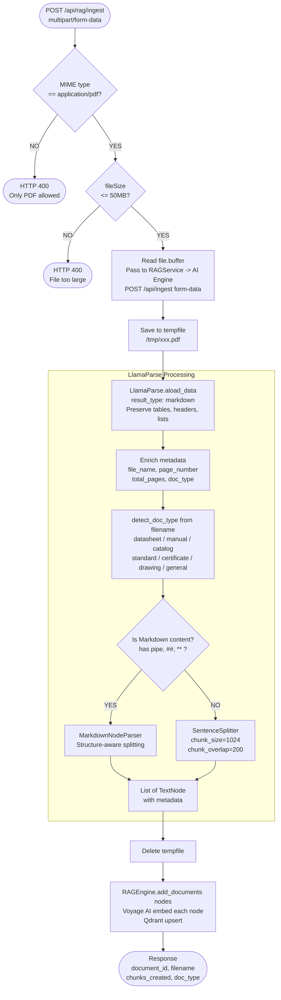

---

## 11. Google Drive Sync Flow

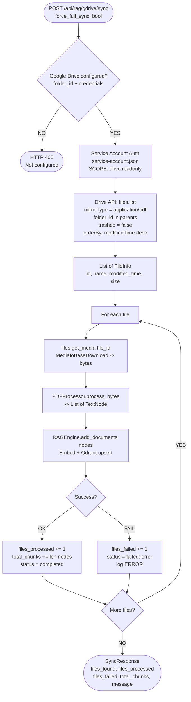

---

## 12. Startup Sequence

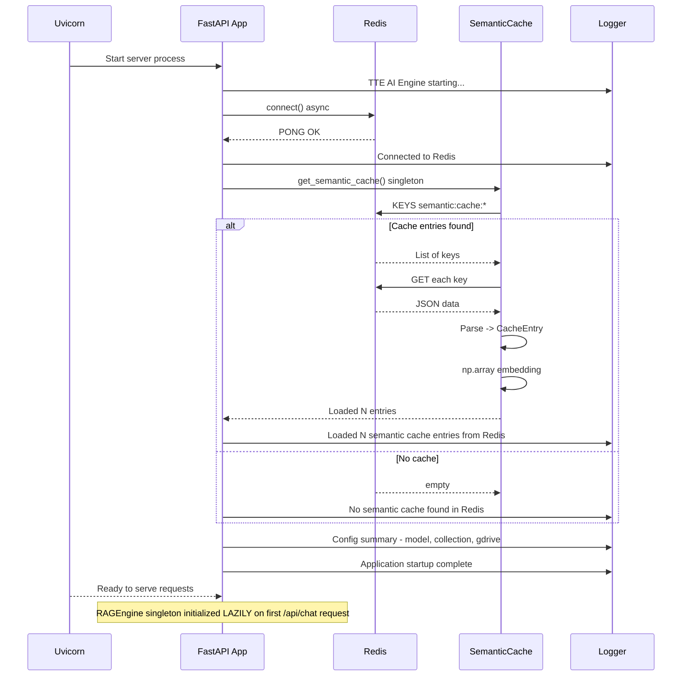

---

## 13. Deployment Topology

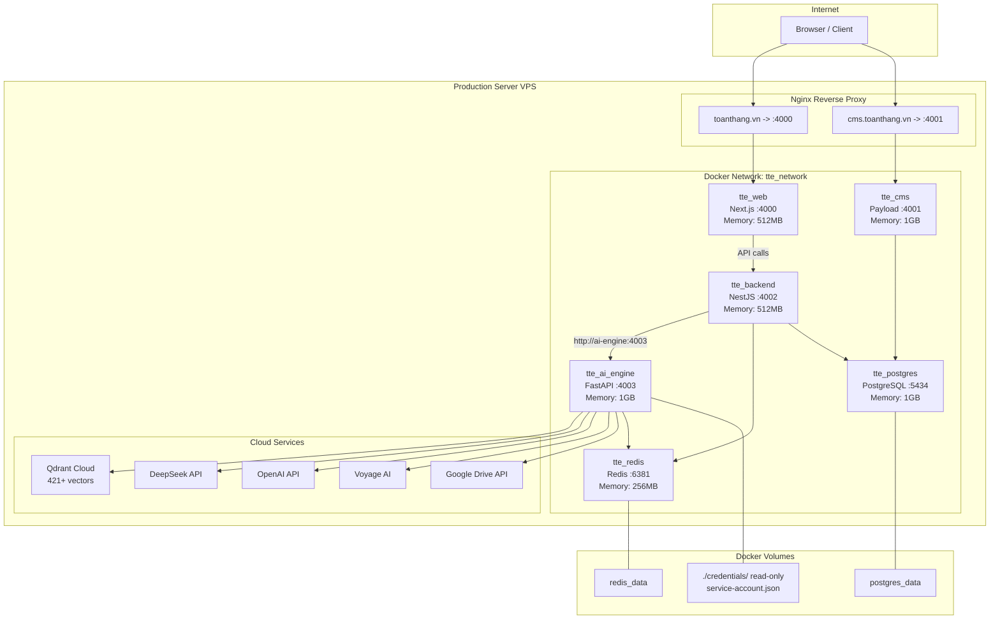

---

## 14. Component Dependencies

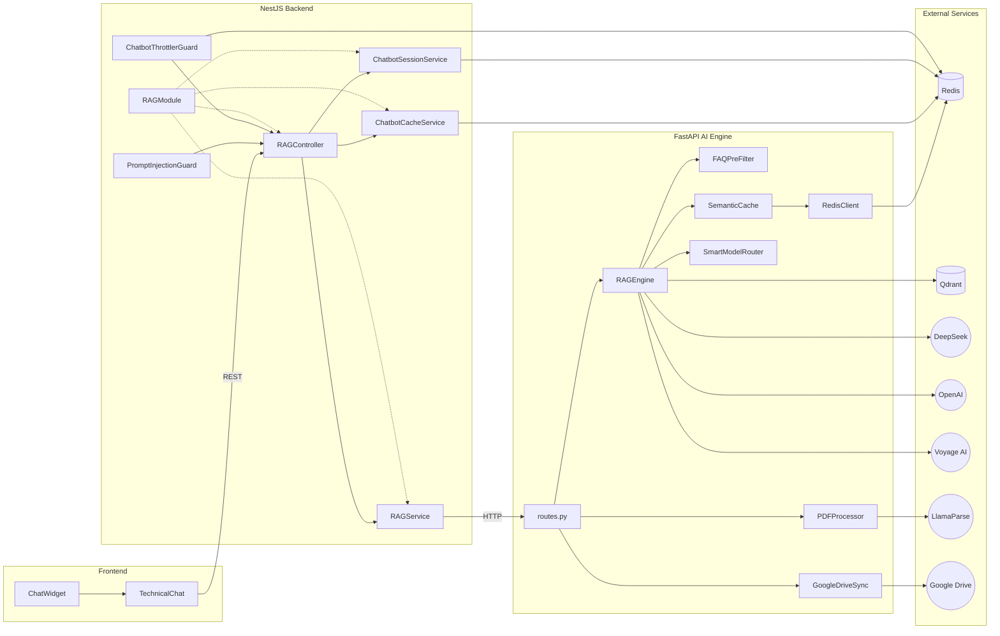

---

## 15. Redis Key Lifecycle

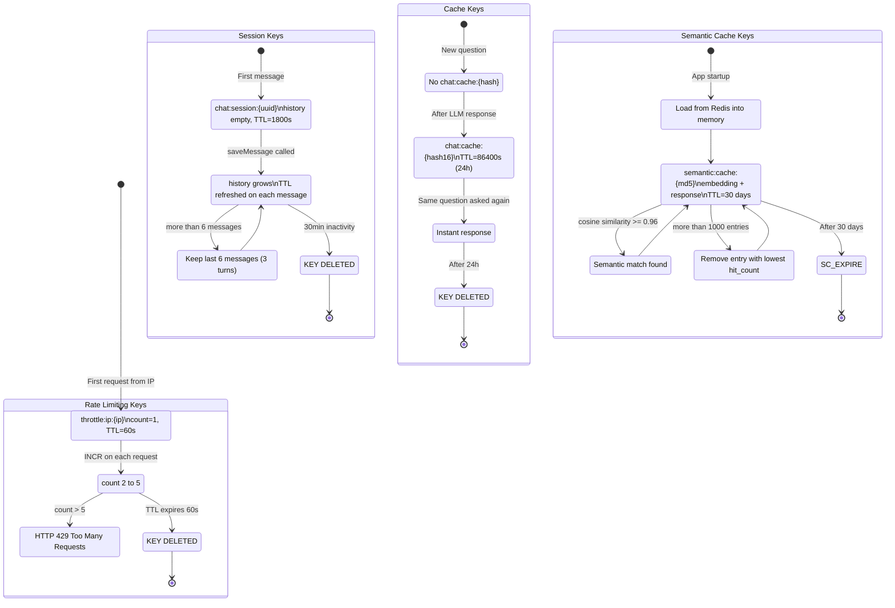

---
