# RAG Architecture — TTE AI Engine

Tài liệu phân tích chi tiết kiến trúc RAG (Retrieval-Augmented Generation) của chatbot TTE, tập trung vào pipeline xử lý, các cải tiến đã triển khai, và cách các thành phần tương tác với nhau.

---

## Tổng quan hệ thống

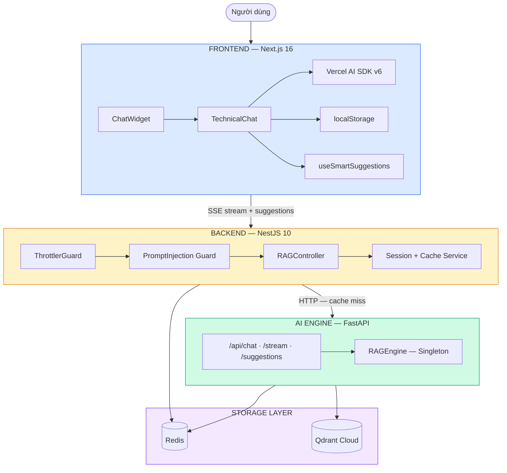

| Layer | Components | Chi tiết |
|-------|-----------|----------|
| **Frontend** | ChatWidget, TechnicalChat, Vercel AI SDK v6 | useChat + TextStreamChatTransport, localStorage (session_id, messages x20), SuggestionChips |
| **Backend** | ThrottlerGuard, PromptInjection Guard, RAGController | Rate limit: IP 5/min, Session 20/hr, Global 100/min |
| **AI Engine** | RAGEngine (Singleton), Routes | /api/chat, /api/chat/stream, /api/chat/suggestions |
| **Storage** | Redis, Qdrant Cloud | semantic:cache 30d, suggestions 24h, session 30min, cache 24h · Vectors 1024d Cosine + Text Index |

---

## RAG Pipeline chi tiết

Toàn bộ pipeline được chia thành **2 giai đoạn chính**: **Ingestion** (nạp tài liệu) và **Query** (truy vấn). Mỗi giai đoạn có nhiều bước tối ưu hóa.

---

### 1. Ingestion Pipeline — Từ PDF đến Vector

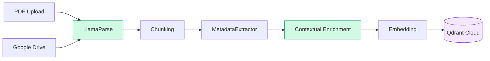

| Bước | Module | Chi tiết |
|------|--------|----------|
| **PDF Upload** | POST /api/ingest | Upload trực tiếp hoặc Google Drive auto-sync |
| **LlamaParse** | AI Parse → Markdown | Giữ bảng, heading, format nguyên vẹn. Đơn vị: PSI, bar, mm |
| **Chunking** | MarkdownNodeParser / SentenceSplitter | 1024 tokens, overlap 200. Markdown-aware nếu có bảng/heading |
| **MetadataExtractor** | DeepSeek LLM (T=0.0) | Extract: brand, product_type, pressure_class, size_range, certification... |
| **Contextual Enrichment** | DeepSeek LLM (T=0.0, 256 tokens) | Prepend document context vào mỗi chunk. Batch 5 concurrent |
| **Embedding** | Voyage AI voyage-3.5-lite | 1024 dimensions |
| **Qdrant Cloud** | Vector Store | HNSW index + Text payload index cho keyword search |

#### 1.1 Chunking — Chia nhỏ tài liệu

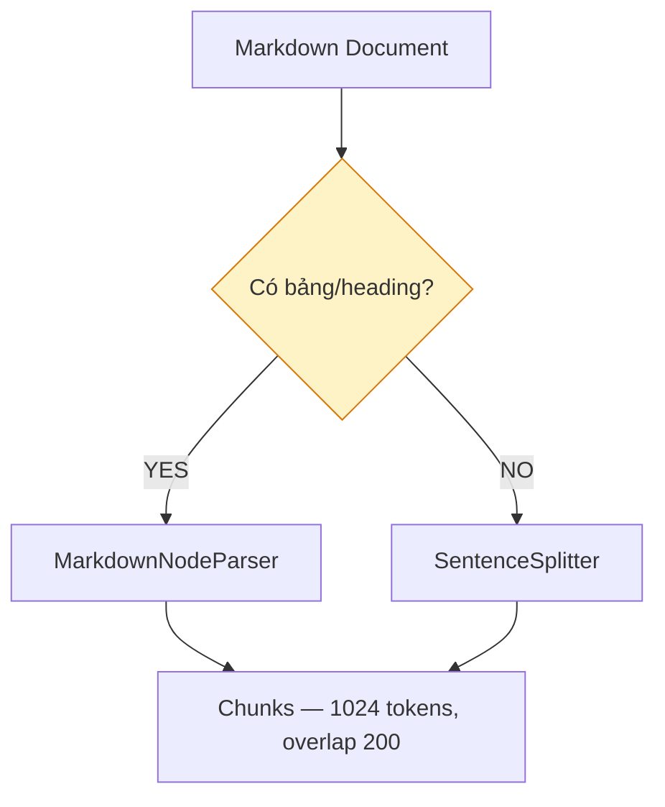

#### 1.2 Contextual Enrichment — Giàu hóa ngữ cảnh

Kỹ thuật **Contextual Retrieval** từ Anthropic — giải quyết vấn đề chunk mất ngữ cảnh.

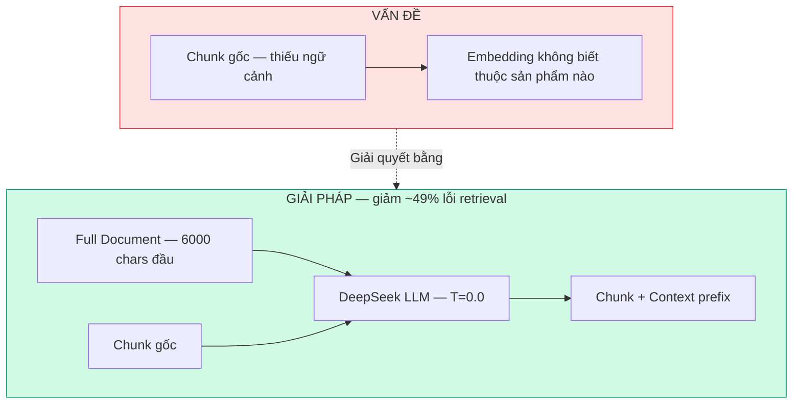

**Trước và sau enrichment:**

| | Trước | Sau |
|---|-------|-----|
| **Chunk** | "Áp suất tối đa: 4150 PSI, Nhiệt độ: -46°C đến 593°C" | "[Context: Fisher HP Series control valve datasheet, Technical Specifications] Áp suất tối đa: 4150 PSI..." |
| **Embedding hiểu** | Thông số kỹ thuật chung chung | Thông số của Fisher HP control valve |
| **Search** | Có thể miss khi hỏi "Fisher HP pressure" | Tìm chính xác |

> **Lưu ý:** `original_text` lưu riêng trong metadata → citation hiển thị KHÔNG có `[Context: ...]`. Nếu LLM fail → dùng chunk gốc (graceful degradation).

---

### 2. Query Pipeline — 7 Phase tối ưu hóa

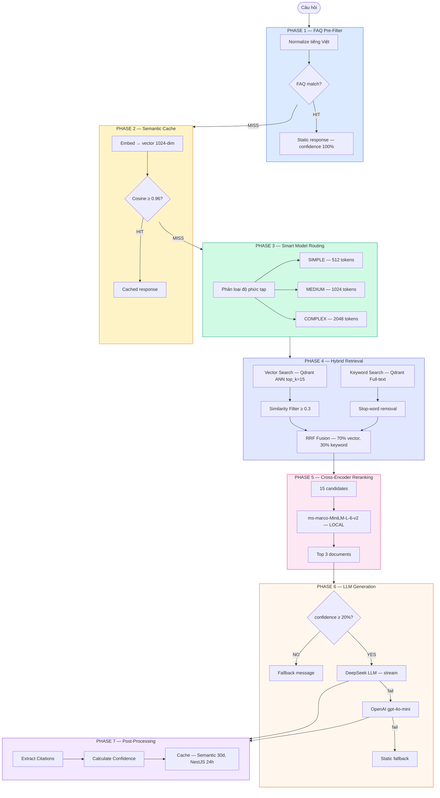

| Phase | Module | Impact | Chi tiết |
|-------|--------|--------|----------|
| **1. FAQ Pre-Filter** | FAQPreFilter | ~50% LLM calls skip | ~50 entries, Vietnamese diacritic normalization, exact + keyword match |
| **2. Semantic Cache** | SemanticCache | +30% cache hit | Cosine ≥ 0.96 (tránh false positive), Redis 30d, LRU 1000 entries |
| **3. Model Routing** | SmartModelRouter | ~40% giảm chi phí LLM | SIMPLE ≤8 words → 512 tokens, COMPLEX ≥2 keywords → 2048 tokens |
| **4. Hybrid Retrieval** | VectorIndexRetriever + QdrantKeywordRetriever | Better recall | RRF Fusion: `score = 0.7/(k+rank_v) + 0.3/(k+rank_k)` |
| **5. Reranking** | ms-marco-MiniLM-L-6-v2 | thêm ~18% giảm lỗi | Cross-encoder LOCAL, ~80MB, $0 cost. 15 → 3 results |
| **6. LLM Generation** | DeepSeek → OpenAI fallback | ~500ms first token | astream_complete() token-by-token, SSE streaming |
| **7. Post-Processing** | Citations + Confidence + Cache | | Weighted avg cosine scores, cap 95%, deduplicate by file+page |

**Tại sao Hybrid Search?**
- **Vector**: tốt cho ngữ nghĩa ("van chịu áp lực cao" → Fisher HP)
- **Keyword**: tốt cho exact match ("DVC6200" → đúng model number)

**Tại sao threshold 0.96?**
- "van điều khiển" vs "van an toàn" ≈ 0.93-0.95 → 0.92 gây false positive cache hit

---

### 3. Smart Suggestions Pipeline — Gợi ý follow-up

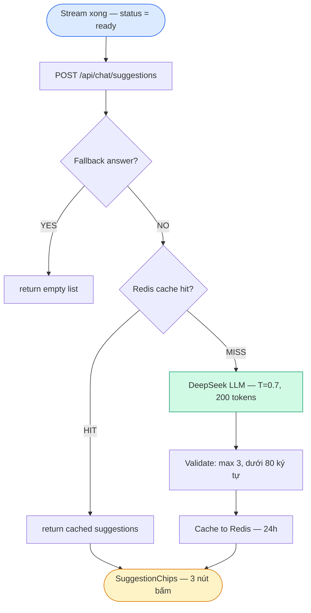

| Chi tiết | Giá trị |
|----------|---------|
| **Endpoint** | POST /api/chat/suggestions (async, tách biệt chat flow) |
| **Prompt** | Few-shot: 1 câu đi sâu, 1 câu so sánh, 1 câu ứng dụng thực tế |
| **Fallback detection** | Skip nếu answer chứa "Xin lỗi, tôi chưa tìm thấy" / "I apologize" |
| **Error handling** | NEVER throws → return `[]` → UI ẩn suggestions |
| **Chi phí** | ~$0.00004/call |

---

## Singleton Pattern — Module Registry

Tất cả core module dùng Singleton pattern để tránh re-initialization (~500ms/request).

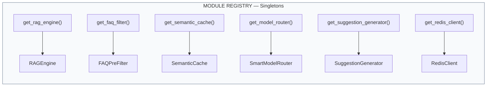

| Factory | Class | Nội dung |
|---------|-------|----------|
| `get_rag_engine()` | RAGEngine | Qdrant clients, VectorStoreIndex, Reranker (lazy), KeywordRetriever (lazy) |
| `get_faq_filter()` | FAQPreFilter | ~50 FAQ entries bilingual, Vietnamese normalization |
| `get_semantic_cache()` | SemanticCache | In-memory + Redis backup, 1000 max entries LRU, Cosine ≥ 0.96 |
| `get_model_router()` | SmartModelRouter | Complexity classification, Token limit routing |
| `get_suggestion_generator()` | SuggestionGenerator | DeepSeek T=0.7, Redis cache 24h |
| `get_redis_client()` | RedisClient | Async aioredis, Auto-reconnect |

---

## External Services & Dependencies

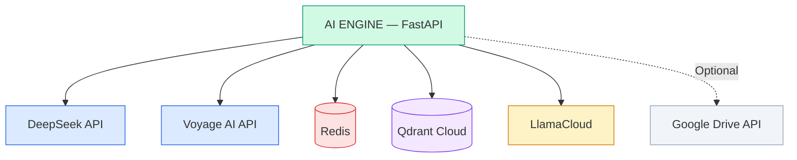

| Service | Mục đích | Fallback |
|---------|---------|----------|
| **DeepSeek API** | Chat LLM, Enrichment, Suggestion, Metadata | OpenAI gpt-4o-mini |
| **Voyage AI API** | Embedding 1024 dims (voyage-3.5-lite) | OpenAI text-embedding-3-small |
| **Redis** | Semantic cache 30d, Suggestion 24h, Session 30min, Response 24h | In-memory only |
| **Qdrant Cloud** | Vector Store (ANN) + BM25 Full-text Index | N/A (required) |
| **LlamaCloud** | PDF Parse via LlamaParse, 1000 pages/day free | N/A |
| **Google Drive API** | Auto-sync PDFs, incremental by modified_time | Optional |

---

## Tổng kết: Pipeline tối ưu hóa chi phí

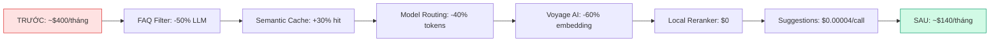

> **10,000 queries/ngày — tiết kiệm ~65%**: FAQ skip 5,000 → Semantic cache 1,500 → Model routing giảm 40% tokens → Voyage AI embedding 60% rẻ hơn → Reranker chạy local $0 → Suggestions ~$0.00004/call

---

## Retrieval Quality — Các cải tiến đã triển khai

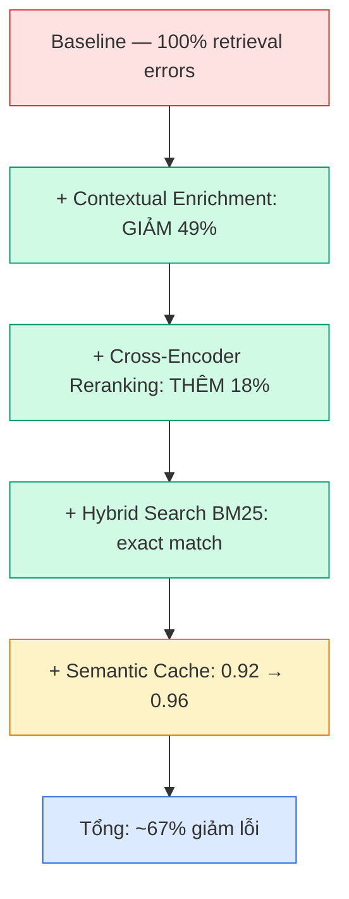

| Cải tiến | Impact | Chi tiết |
|----------|--------|----------|
| **Contextual Enrichment** | -49% lỗi retrieval | Chunk biết thuộc tài liệu nào, sản phẩm nào |
| **Cross-Encoder Reranking** | thêm -18% lỗi | ms-marco-MiniLM-L-6-v2, local, $0. Top 15 → Top 3 |
| **Hybrid Search / BM25** | cải thiện exact match | Model numbers (DVC6200, MR95) tìm được chính xác |
| **Semantic Cache Tuning** | giảm false positive | "van điều khiển" ≠ "van an toàn" (sim ≈ 0.93-0.95) |

---

## Data Model — Qdrant Vector Entry

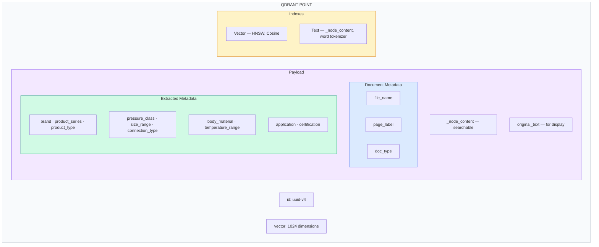

**Ví dụ payload đầy đủ:**

| Field | Value |
|-------|-------|
| `_node_content` | `[Context: Fisher HP Series...] Áp suất tối đa: 4150 PSI...` |
| `original_text` | `Áp suất làm việc tối đa: 4150 PSI...` |
| `file_name` | `Fisher_HP_Datasheet.pdf` |
| `page_label` | `3` |
| `doc_type` | `datasheet` |
| `brand` | `Fisher` |
| `product_type` | `Control Valve` |
| `pressure_class` | `CL2500` |
| `certification` | `API 6D, API 607` |

---

## Streaming Architecture — Token-by-token

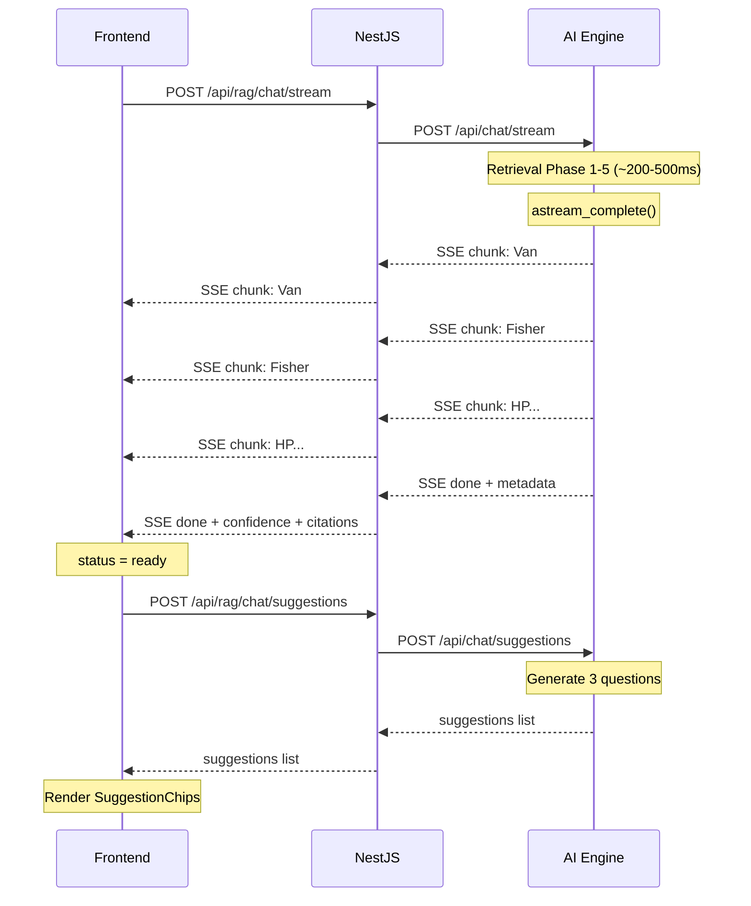

> **Headers**: `X-Accel-Buffering: no` (disable Nginx buffering)
> **Format**: `data: {"type":"chunk|done|error","data":"..."}\n\n`

---

## Fallback Chain — Đảm bảo 99.9% uptime

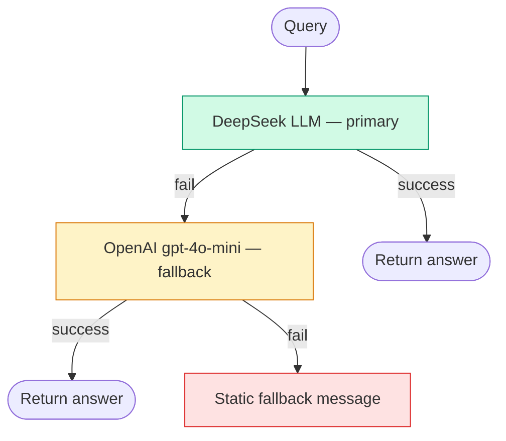

| Fallback | Trigger | Response |
|----------|---------|----------|
| **DeepSeek → OpenAI** | API error, timeout, rate limit | Chuyển sang gpt-4o-mini |
| **Programmatic** | confidence < 20% OR sources = 0 | Static message + contact info |
| **Static message** | Cả 2 LLM fail | VI: "Xin lỗi, tôi chưa tìm thấy..." / EN: "I apologize..." |

---

## File Map — Source Code Reference

```
apps/ai-engine/
├── src/
│   ├── main.py                              # FastAPI app, CORS, lifespan
│   ├── config/
│   │   └── settings.py                      # Pydantic Settings (tất cả config)
│   ├── api/
│   │   ├── routes.py                        # /chat, /stream, /suggestions, /ingest
│   │   └── models.py                        # Request/Response schemas
│   ├── core/
│   │   ├── rag_engine.py                    # ★ Core RAG pipeline (query + stream)
│   │   ├── faq_filter.py                    # Phase 1: FAQ pre-filter
│   │   ├── semantic_cache.py                # Phase 2: Embedding-based cache
│   │   ├── model_router.py                  # Phase 3: Complexity routing
│   │   ├── suggestion_generator.py          # Smart follow-up suggestions
│   │   └── redis_client.py                  # Async Redis client (singleton)
│   ├── ingestion/
│   │   ├── pdf_processor.py                 # LlamaParse + chunking pipeline
│   │   ├── contextual_enricher.py           # Contextual Retrieval (LLM enrich)
│   │   ├── metadata_extractor.py            # LLM-extracted structured metadata
│   │   └── gdrive_sync.py                   # Google Drive auto-sync
│   └── retrieval/
│       ├── keyword_retriever.py             # Qdrant full-text + RRF fusion
│       └── auto_retriever.py                # LLM-powered metadata filtering
```
