# RAG Architecture — TTE AI Engine

Tài liệu phân tích chi tiết kiến trúc RAG (Retrieval-Augmented Generation) của chatbot TTE, tập trung vào pipeline xử lý, các cải tiến đã triển khai, và cách các thành phần tương tác với nhau.

---

## Tổng quan hệ thống

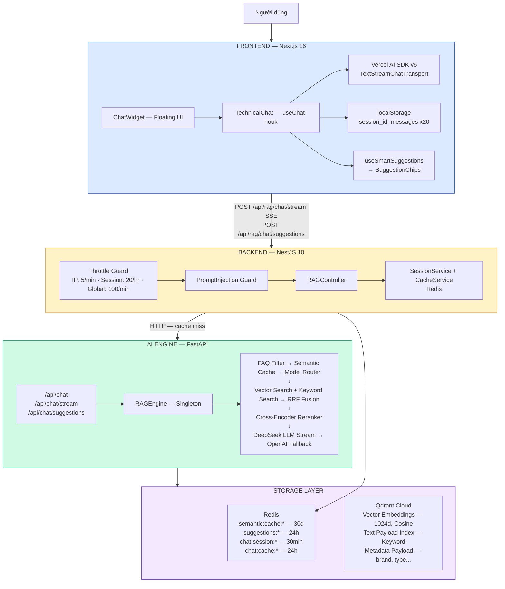


---

## RAG Pipeline chi tiết

Toàn bộ pipeline được chia thành **2 giai đoạn chính**: **Ingestion** (nạp tài liệu) và **Query** (truy vấn). Mỗi giai đoạn có nhiều bước tối ưu hóa.

---

### 1. Ingestion Pipeline — Từ PDF đến Vector

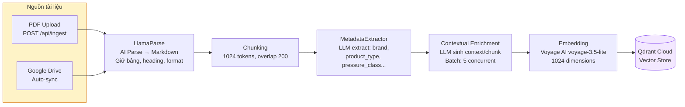


#### 1.1 PDF Parsing — LlamaParse

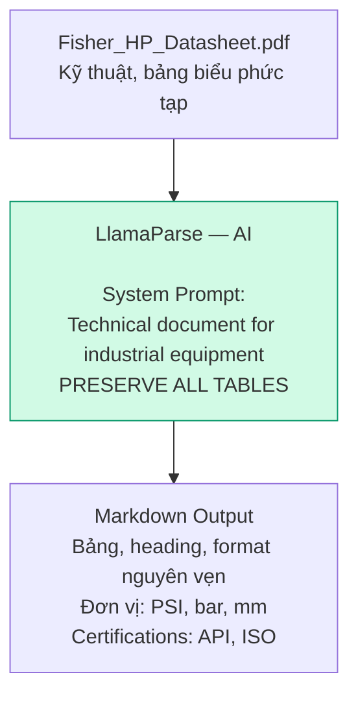


#### 1.2 Chunking — Chia nhỏ tài liệu

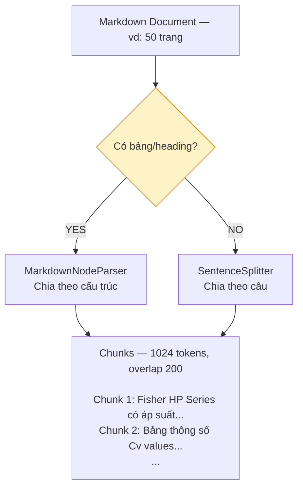


#### 1.3 Contextual Enrichment — Giàu hóa ngữ cảnh

Đây là kỹ thuật **Contextual Retrieval** từ Anthropic — giải quyết vấn đề chunk mất ngữ cảnh.

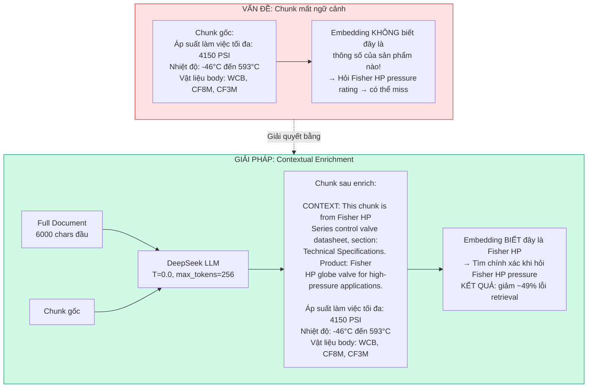


**Lưu ý kỹ thuật:**

- `original_text` được lưu riêng trong metadata → hiển thị citation KHÔNG có phần `[Context: ...]`
- Batch processing: 5 chunks xử lý đồng thời (`asyncio.gather`)
- Nếu LLM fail cho chunk nào → dùng chunk gốc (graceful degradation)

#### 1.4 Metadata Extraction — Trích xuất metadata có cấu trúc

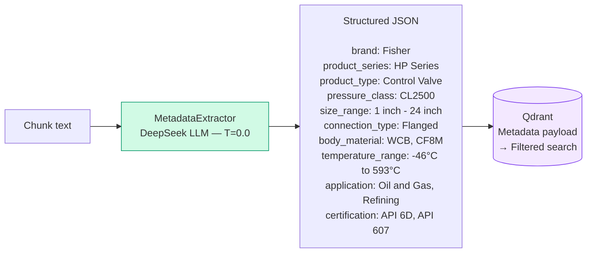


---

### 2. Query Pipeline — 7 Phase tối ưu hóa

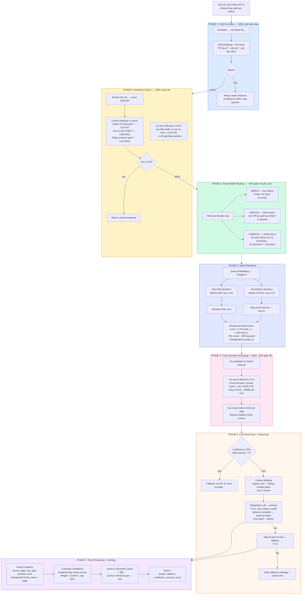


**Tại sao Hybrid Search (Phase 4)?**

- **Vector search**: tốt cho câu hỏi ngữ nghĩa ("van chịu áp lực cao" → Fisher HP)
- **Keyword search**: tốt cho exact match ("DVC6200" → đúng model number)
- **RRF Fusion**: kết hợp ưu điểm của cả hai

**Bi-encoder vs Cross-encoder (Phase 5):**

- Bi-encoder: `encode(query)` · `encode(doc)` → nhanh nhưng kém chính xác
- Cross-encoder: `encode(query + doc cùng lúc)` → chậm hơn nhưng chính xác hơn nhiều

---

### 3. Smart Suggestions Pipeline — Gợi ý follow-up

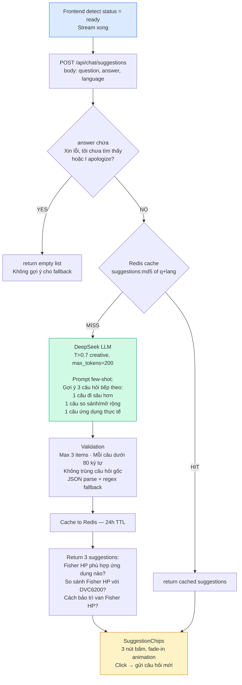


> **Error handling**: NEVER throws → return `[]` → UI ẩn suggestions
> **Chi phí**: ~$0.00004/call

---

## Singleton Pattern — Module Registry

Tất cả core module dùng Singleton pattern để tránh re-initialization.

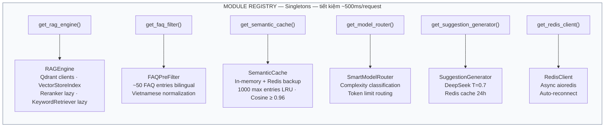


---

## External Services & Dependencies

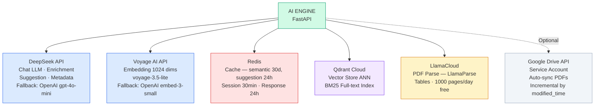


---

## Tổng kết: Pipeline tối ưu hóa chi phí

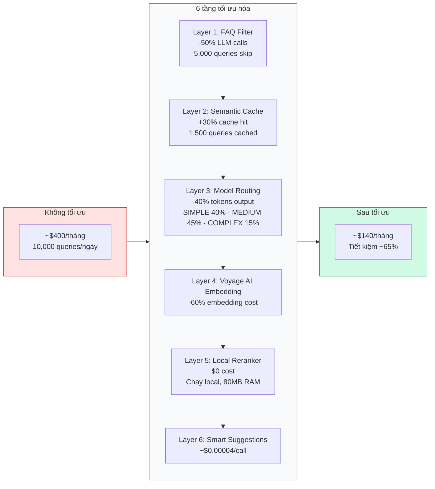


---

## Retrieval Quality — Các cải tiến đã triển khai

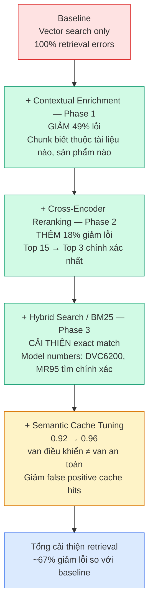


---

## Data Model — Qdrant Vector Entry

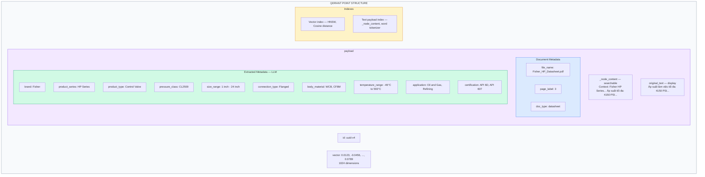


---

## Streaming Architecture — Token-by-token

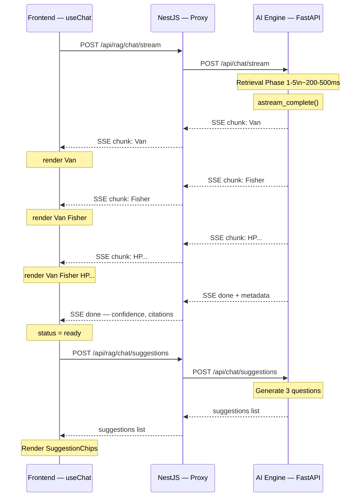


> **Headers**: `X-Accel-Buffering: no` (disable Nginx buffering)
> **Format**: `data: {"type":"chunk|done|error","data":"..."}\n\n`

---

## Fallback Chain — Đảm bảo 99.9% uptime

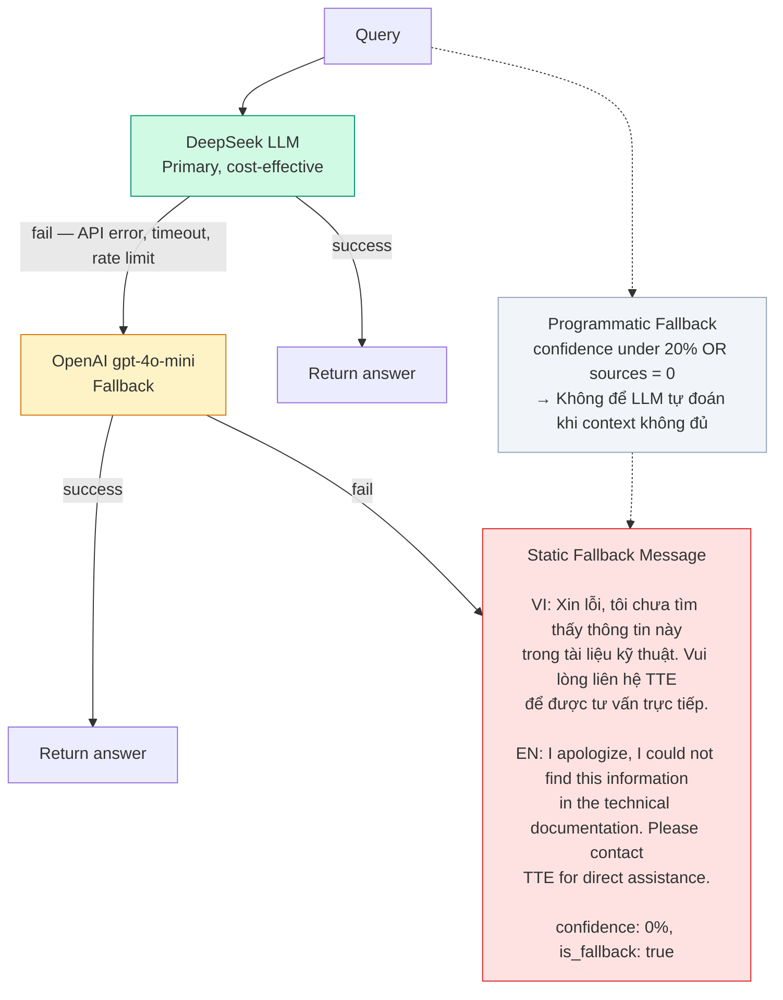


---

## File Map — Source Code Reference

```
apps/ai-engine/
├── src/
│   ├── main.py                              # FastAPI app, CORS, lifespan
│   ├── config/
│   │   └── settings.py                      # Pydantic Settings (tất cả config)
│   ├── api/
│   │   ├── routes.py                        # /chat, /stream, /suggestions, /ingest
│   │   └── models.py                        # Request/Response schemas
│   ├── core/
│   │   ├── rag_engine.py                    # ★ Core RAG pipeline (query + stream)
│   │   ├── faq_filter.py                    # Phase 1: FAQ pre-filter
│   │   ├── semantic_cache.py                # Phase 2: Embedding-based cache
│   │   ├── model_router.py                  # Phase 3: Complexity routing
│   │   ├── suggestion_generator.py          # Smart follow-up suggestions
│   │   └── redis_client.py                  # Async Redis client (singleton)
│   ├── ingestion/
│   │   ├── pdf_processor.py                 # LlamaParse + chunking pipeline
│   │   ├── contextual_enricher.py           # Contextual Retrieval (LLM enrich)
│   │   ├── metadata_extractor.py            # LLM-extracted structured metadata
│   │   └── gdrive_sync.py                   # Google Drive auto-sync
│   └── retrieval/
│       ├── keyword_retriever.py             # Qdrant full-text + RRF fusion
│       └── auto_retriever.py                # LLM-powered metadata filtering
```

