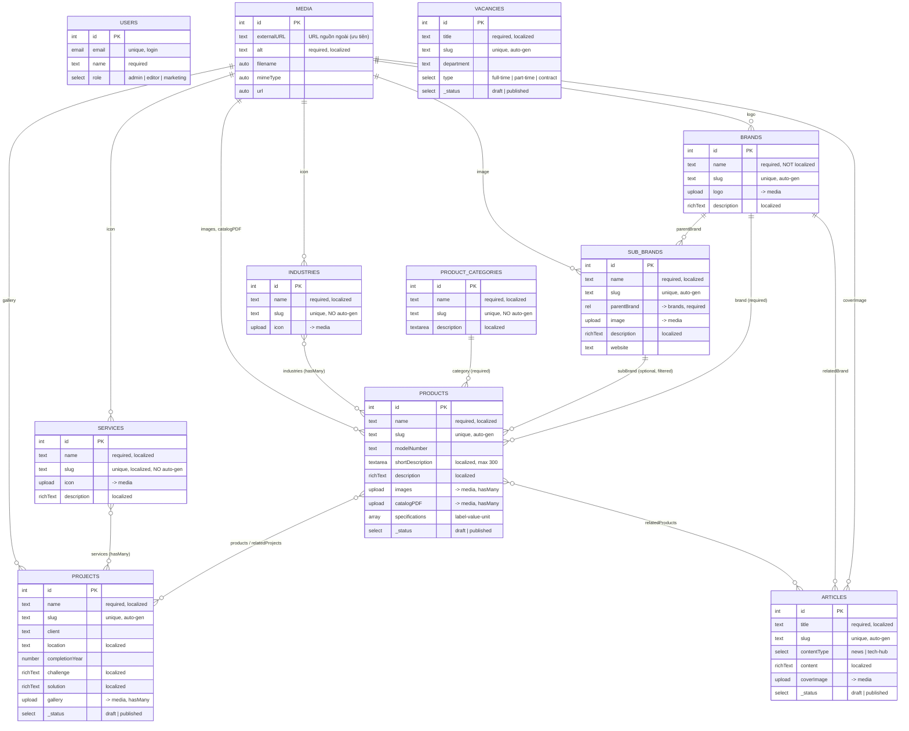
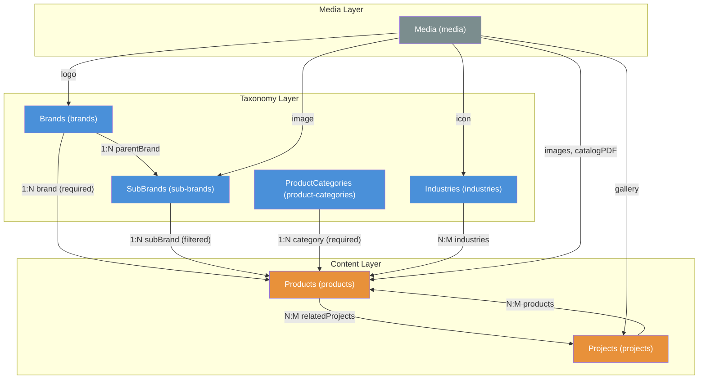

# PayloadCMS — Current State Documentation

> Tài liệu hiện trạng chính xác, được tạo từ khảo sát source code trực tiếp.
> Thay thế `/docs/database/SCHEMA.md` (lỗi thời) làm nguồn tham chiếu chính.
>
> **Cập nhật lần cuối:** 2026-03-24 — dựa trên commit `0425f8f`

---

## Table of Contents

- [Configuration Overview](#configuration-overview)
- [Entity Relationship Diagram](#entity-relationship-diagram)
- [Product Taxonomy Diagram](#product-taxonomy-diagram)
- [Collections — Product Domain](#collections--product-domain)
- [Collections — Taxonomy](#collections--taxonomy)
- [Collections — Other Content](#collections--other-content)
- [Collections — System](#collections--system)
- [Globals](#globals)
- [Frontend Data Layer](#frontend-data-layer)

---

## Configuration Overview

| Property | Value | Source file |
|----------|-------|------------|
| Database | PostgreSQL 16 via `@payloadcms/db-postgres` (Drizzle ORM) | `payload.config.ts:75` |
| Rich text editor | Lexical (`@payloadcms/richtext-lexical`) | `payload.config.ts:67` |
| Locales | `vi` (default), `en` — fallback enabled | `payload.config.ts:81-88` |
| Image processor | Sharp | `payload.config.ts:95` |
| Media types | `image/*`, `application/pdf` | `Media.ts:34` |
| Image sizes | thumbnail (400×300), card (768×512), hero (1920×1080) | `Media.ts:13-32` |
| Server URL | `PAYLOAD_PUBLIC_SERVER_URL` hoặc `http://localhost:4001` | `payload.config.ts:31` |
| CORS | `FRONTEND_URL` (default 3000), `BACKEND_URL` (default 3002) | `payload.config.ts:90-93` |

---

## Entity Relationship Diagram

> Toàn bộ hệ thống CMS — bao gồm tất cả collections và globals.



---

## Product Taxonomy Diagram

> Trực quan hoá cấu trúc phân loại sản phẩm — focus area chính.



**Quan hệ chính:**

| From | To | Type | Field | Required | Notes |
|------|----|------|-------|----------|-------|
| SubBrands | Brands | N:1 | `parentBrand` | Yes | Mỗi sub-brand thuộc 1 brand |
| Products | Brands | N:1 | `brand` | **Yes** | Bắt buộc |
| Products | SubBrands | N:1 | `subBrand` | No | Ẩn khi chưa chọn brand, filtered by brand |
| Products | ProductCategories | N:1 | `category` | **Yes** | Bắt buộc |
| Products | Industries | N:M | `industries` | No | Sản phẩm phục vụ nhiều ngành |
| Products | Projects | N:M | `relatedProjects` | No | Liên kết 2 chiều với Projects |
| Projects | Products | N:M | `products` | No | Liên kết 2 chiều với Products |

---

## Collections — Product Domain

### Products

> **Source:** `apps/cms/src/collections/Products.ts`
> **Slug:** `products` · **Admin group:** Content · **Versions/drafts:** Yes
> **Access:** read = public · **useAsTitle:** `name`

Giao diện admin dùng 4 tabs:

#### Tab 1: Basic Info

| Field | Type | Required | Localized | Unique | Hooks | Notes |
|-------|------|----------|-----------|--------|-------|-------|
| `name` | text | Yes | Yes | - | - | Tên sản phẩm |
| `modelNumber` | text | - | - | - | - | Mã sản phẩm (không cần dịch) |
| `shortDescription` | textarea | - | Yes | - | - | maxLength: 300 |
| `description` | richText | - | Yes | - | - | Lexical editor |

#### Tab 2: Media

| Field | Type | Required | Localized | Unique | Hooks | Notes |
|-------|------|----------|-----------|--------|-------|-------|
| `images` | upload → media | - | - | - | - | hasMany: true |
| `catalogPDF` | upload → media | - | - | - | - | hasMany: true, file PDF catalog |

#### Tab 3: Specifications

| Field | Type | Required | Localized | Unique | Hooks | Notes |
|-------|------|----------|-----------|--------|-------|-------|
| `specifications` | array | - | - | - | - | Mảng thông số kỹ thuật |
| ↳ `label` | text | Yes | Yes | - | - | VD: "Áp suất tối đa" |
| ↳ `value` | text | Yes | Yes | - | - | VD: "100" |
| ↳ `unit` | text | - | Yes | - | - | VD: "Bar" |

#### Tab 4: Relationships

| Field | Type | Required | Localized | Unique | Hooks | Notes |
|-------|------|----------|-----------|--------|-------|-------|
| `brand` | rel → brands | **Yes** | - | - | - | Đơn lẻ |
| `subBrand` | rel → sub-brands | No | - | - | - | Đơn lẻ, filtered by brand, ẩn khi chưa chọn brand |
| `category` | rel → product-categories | **Yes** | - | - | - | Đơn lẻ |
| `industries` | rel → industries | No | - | - | - | hasMany: true |
| `relatedProjects` | rel → projects | No | - | - | - | hasMany: true |

#### Sidebar

| Field | Type | Required | Localized | Unique | Hooks | Notes |
|-------|------|----------|-----------|--------|-------|-------|
| `slug` | text | - | - | Yes | `formatSlug('name')` | Tự động tạo từ tên |
| `featured` | checkbox | - | - | - | - | Sidebar, đánh dấu nổi bật |
| `sortOrder` | number | - | - | - | - | Sidebar, thứ tự hiển thị |

#### Tab 5: SEO

| Field | Type | Required | Localized | Unique | Hooks | Notes |
|-------|------|----------|-----------|--------|-------|-------|
| `seo.metaTitle` | text | - | Yes | - | - | Max 60 ký tự |
| `seo.metaDescription` | textarea | - | Yes | - | - | Max 160 ký tự |

---

## Collections — Taxonomy

### Brands

> **Source:** `apps/cms/src/collections/Taxonomies/Brands.ts`
> **Slug:** `brands` · **Admin group:** Taxonomies · **Versions:** No
> **Access:** read = public

| Field | Type | Required | Localized | Unique | Hooks | Notes |
|-------|------|----------|-----------|--------|-------|-------|
| `name` | text | Yes | **No** | - | - | Tên brand (proper noun, không dịch) |
| `slug` | text | - | - | Yes | `formatSlug('name')` | Sidebar |
| `logo` | upload → media | - | - | - | - | Logo thương hiệu |
| `description` | richText | - | Yes | - | - | Mô tả brand |

### SubBrands

> **Source:** `apps/cms/src/collections/Taxonomies/SubBrands.ts`
> **Slug:** `sub-brands` · **Admin group:** Taxonomies · **Versions:** No
> **Access:** read = public

| Field | Type | Required | Localized | Unique | Hooks | Notes |
|-------|------|----------|-----------|--------|-------|-------|
| `name` | text | Yes | Yes | - | - | Tên sub-brand |
| `slug` | text | - | - | Yes | `formatSlug('name')` | Sidebar |
| `parentBrand` | rel → brands | Yes | - | - | - | Thuộc brand nào |
| `image` | upload → media | - | - | - | - | Hình ảnh đại diện |
| `description` | richText | - | Yes | - | - | Mô tả |
| `website` | text | - | - | - | - | Website riêng |

### ProductCategories

> **Source:** `apps/cms/src/collections/Taxonomies/ProductCategories.ts`
> **Slug:** `product-categories` · **Admin group:** Taxonomies · **Versions:** No
> **Access:** read = public

| Field | Type | Required | Localized | Unique | Hooks | Notes |
|-------|------|----------|-----------|--------|-------|-------|
| `name` | text | Yes | Yes | - | - | Tên danh mục |
| `slug` | text | - | - | Yes | `formatSlug('name')` | Sidebar |
| `description` | textarea | - | Yes | - | - | Mô tả danh mục |
| `icon` | upload → media | - | - | - | - | Icon/hình ảnh đại diện |
| `order` | number | - | - | - | - | Sidebar, thứ tự hiển thị |

### Industries

> **Source:** `apps/cms/src/collections/Taxonomies/Industries.ts`
> **Slug:** `industries` · **Admin group:** Taxonomies · **Versions:** No
> **Access:** read = public

| Field | Type | Required | Localized | Unique | Hooks | Notes |
|-------|------|----------|-----------|--------|-------|-------|
| `name` | text | Yes | Yes | - | - | Tên ngành |
| `slug` | text | - | - | Yes | `formatSlug('name')` | Sidebar |
| `icon` | upload → media | - | - | - | - | Icon ngành |

---

## Collections — Other Content

### Projects

> **Source:** `apps/cms/src/collections/Projects.ts`
> **Slug:** `projects` · **Admin group:** Content · **Versions/drafts:** Yes
> **Access:** read = public · **useAsTitle:** `name`

| Field | Type | Required | Localized | Unique | Hooks | Notes |
|-------|------|----------|-----------|--------|-------|-------|
| `name` | text | Yes | Yes | - | - | Tên dự án |
| `slug` | text | - | - | Yes | `formatSlug('name')` | Sidebar |
| `client` | text | - | - | - | - | Khách hàng |
| `location` | text | - | Yes | - | - | Địa điểm |
| `completionYear` | number | - | - | - | - | Sidebar, min 1990 max 2100 |
| `challenge` | richText | - | Yes | - | - | Thách thức dự án |
| `solution` | richText | - | Yes | - | - | Giải pháp TTE cung cấp |
| `gallery` | upload → media | - | - | - | - | hasMany: true |
| `products` | rel → products | - | - | - | - | hasMany: true |
| `services` | rel → services | - | - | - | - | hasMany: true |

### Services

> **Source:** `apps/cms/src/collections/Services.ts`
> **Slug:** `services` · **Admin group:** Content · **Versions:** No
> **Access:** read = public · **useAsTitle:** `name`

| Field | Type | Required | Localized | Unique | Hooks | Notes |
|-------|------|----------|-----------|--------|-------|-------|
| `name` | text | Yes | Yes | - | - | Tên dịch vụ |
| `slug` | text | - | - | Yes | `formatSlug('name')` | Sidebar |
| `icon` | upload → media | - | - | - | - | Icon dịch vụ |
| `description` | richText | - | Yes | - | - | Mô tả dịch vụ |

### Articles

> **Source:** `apps/cms/src/collections/Articles.ts`
> **Slug:** `articles` · **Admin group:** Content · **Versions/drafts:** Yes
> Bao gồm cả News và Tech Hub content. Chi tiết xem source file.

### Vacancies

> **Source:** `apps/cms/src/collections/Vacancies.ts`
> **Slug:** `vacancies` · **Admin group:** Content · **Versions/drafts:** Yes
> Job listings. Chi tiết xem source file.

---

## Collections — System

### Users

> **Source:** `apps/cms/src/collections/Users.ts`
> **Slug:** `users` · **Admin group:** Admin · **Auth:** Yes

| Field | Type | Required | Notes |
|-------|------|----------|-------|
| `email` | email | Yes (auto) | Login identifier |
| `name` | text | Yes | Tên hiển thị |
| `role` | select | Yes | `admin` \| `editor` \| `marketing`, default: `editor` |

**Access:** read = public, create/update/delete = admin only

### Media

> **Source:** `apps/cms/src/collections/Media.ts`
> **Slug:** `media` · **Admin group:** Media

| Field | Type | Required | Localized | Notes |
|-------|------|----------|-----------|-------|
| `externalURL` | text | - | - | URL ảnh từ nguồn ngoài (Cloudinary, S3), ưu tiên hiển thị |
| `alt` | text | Yes | Yes | Mô tả ảnh cho SEO/accessibility |

**Upload config:** staticDir `media`, mimeTypes `image/*` + `application/pdf`
**Image sizes:** thumbnail (400×300), card (768×512), hero (1920×1080)

---

## Globals

### Homepage

> **Source:** `apps/cms/src/globals/Homepage.ts` · **Slug:** `homepage`
> **Access:** read = public

| Tab | Field | Type | Localized | Notes |
|-----|-------|------|-----------|-------|
| Hero | `heroTitle` | text | Yes | Tiêu đề hero |
| Hero | `heroSubtitle` | text | Yes | Phụ đề hero |
| Hero | `heroBanner` | upload → media | - | Banner chính |
| Featured | `featuredProjects` | rel → projects | - | hasMany, dự án nổi bật |
| Featured | `featuredBrands` | rel → brands | - | hasMany, brand đối tác |
| SEO | `seo.metaTitle` | text | Yes | Max 60 ký tự |
| SEO | `seo.metaDescription` | textarea | Yes | Max 160 ký tự |
| SEO | `seo.shareImage` | upload → media | - | Ảnh social sharing |

### AboutPage

> **Source:** `apps/cms/src/globals/AboutPage.ts` · **Slug:** `about-page`
> **Access:** read = public

| Field | Type | Localized | Notes |
|-------|------|-----------|-------|
| `history` | richText | Yes | Lịch sử hình thành |
| `mission` | textarea | Yes | Sứ mệnh |
| `vision` | textarea | Yes | Tầm nhìn |
| `coreValues` | richText | Yes | Giá trị cốt lõi |
| `certificates` | upload → media | - | hasMany, chứng chỉ kinh doanh |
| `seo.metaTitle` | text | Yes | |
| `seo.metaDescription` | textarea | Yes | |
| `seo.shareImage` | upload → media | - | |

### ContactPage

> **Source:** `apps/cms/src/globals/ContactPage.ts` · **Slug:** `contact-page`
> **Access:** read = public

| Field | Type | Localized | Notes |
|-------|------|-----------|-------|
| `address` | text | Yes | Địa chỉ văn phòng |
| `hotline` | text | - | Số hotline |
| `email` | text | - | Email liên hệ |
| `mapEmbed` | textarea | - | Google Maps iframe embed code |
| `seo.metaTitle` | text | Yes | |
| `seo.metaDescription` | textarea | Yes | |
| `seo.shareImage` | upload → media | - | |

---

## Frontend Data Layer

> Ghi nhận hiện trạng data flow từ CMS đến frontend.

### Trạng thái hiện tại

Frontend (`apps/web`) hiện dùng **100% static data** từ `apps/web/lib/data.ts`. CMS API chưa được kích hoạt.

```
Frontend Request → lib/data.ts (static arrays) → Component render
                 ↗ lib/payload/adapter.ts (sẵn sàng nhưng NEXT_PUBLIC_USE_CMS=false)
                 ↗ lib/payload/client.ts (CMS API client đã có)
```

### Cấu trúc static data (`lib/data.ts`)

| Data | Số lượng | Đặc điểm |
|------|----------|----------|
| `brands` | 5 | SubBrands **nested** trong Brand objects (khác CMS: flat collection) |
| `categories` | 6 | Valves, Pumps, Compressors, Control Systems, Filtration, Boilers |
| `industries` | 5 | Oil & Gas, Petrochemical, Power, Water, Manufacturing |
| `products` | 6 | Đầy đủ specs, documents, relatedProjects |

### Khác biệt cấu trúc Static vs CMS

| Aspect | Static data (`lib/data.ts`) | CMS (PayloadCMS) |
|--------|----------------------------|-------------------|
| SubBrands | Nested trong `Brand.subBrands[]` | Flat collection `sub-brands` với `parentBrand` FK |
| Specifications key | `key` | `label` |
| Documents | `documents[]` với `{name, type, url, size}` | `catalogPDF` (upload to media, hasMany) |
| Brand description | `string` | `richText` (Lexical JSON) |
| IDs | `string` ("1", "2") | `number` (auto-increment) |

> Chi tiết các inconsistency xem [ISSUES_AND_GAPS.md](./ISSUES_AND_GAPS.md)
