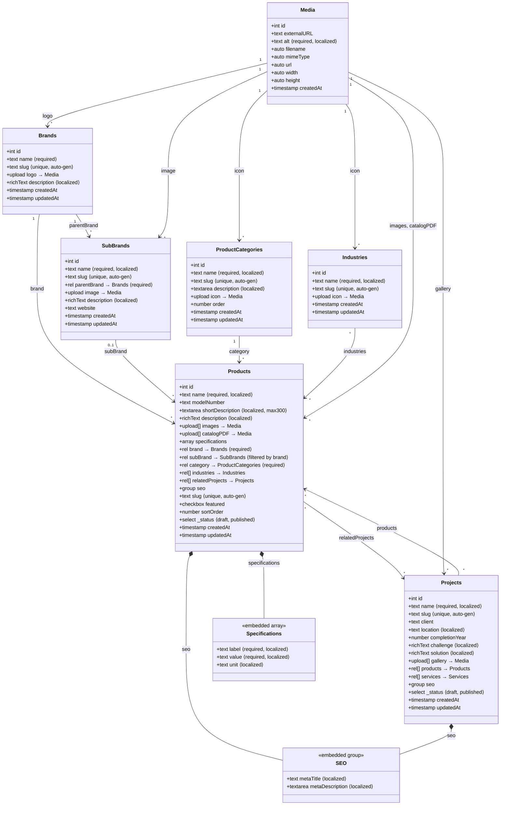
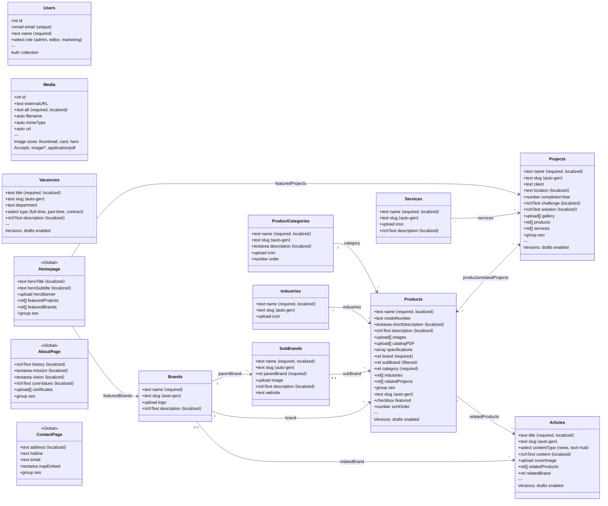
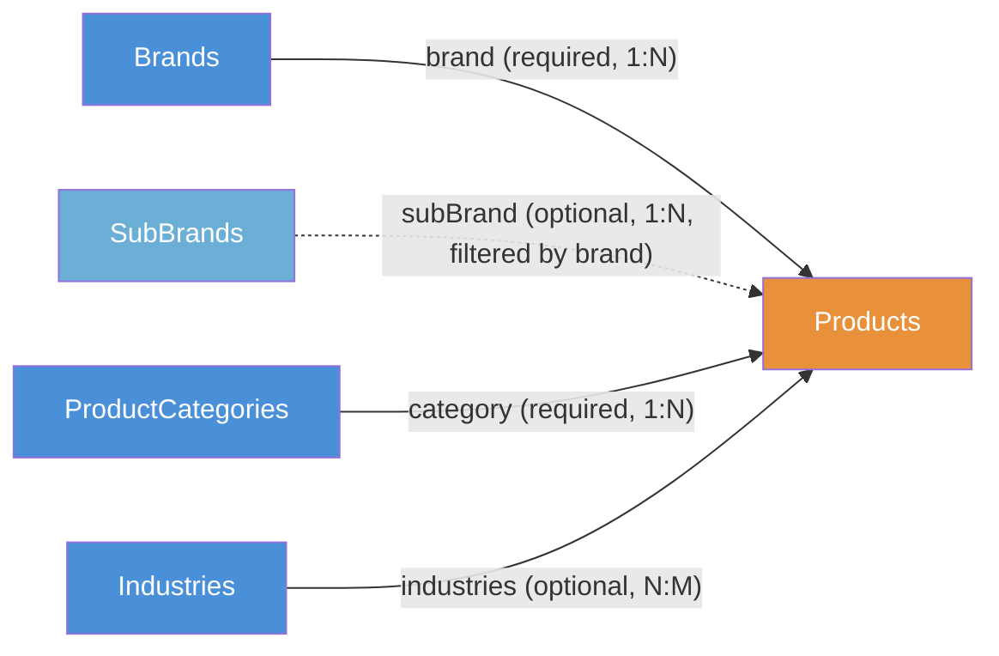
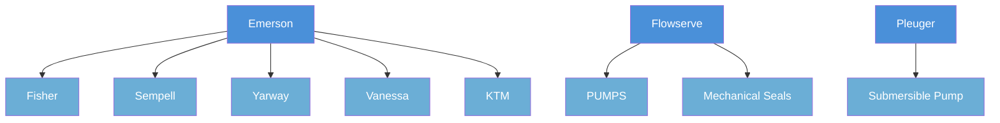
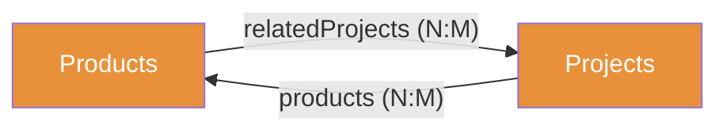
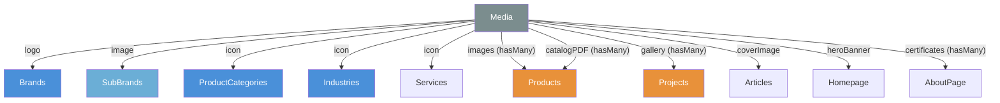

# PayloadCMS — Data Model & Relationships

> Trực quan hoá chi tiết tất cả trường dữ liệu trong từng object và mối quan hệ giữa chúng.
> Tập trung vào product domain (Products, Brands, SubBrands, ProductCategories, Industries).
>
> **Cập nhật lần cuối:** 2026-03-24

---

## Class Diagram — Product Domain

> Hiển thị đầy đủ fields, types, và constraints cho mỗi collection. Đường nối thể hiện relationships.



---

## Class Diagram — Full CMS System

> Bao gồm tất cả collections (Content, Taxonomy, System) và globals.



---

## Relationship Summary

### Product → Taxonomy (Phân loại sản phẩm)



**Quy tắc:**
- Mỗi Product PHẢI có 1 Brand và 1 Category (`required`)
- SubBrand là optional, chỉ hiện khi đã chọn Brand, và được lọc theo Brand đã chọn (`filterOptions`)
- Product có thể thuộc nhiều Industries (`hasMany`)

### Brand → SubBrand Hierarchy



> SubBrands là collection riêng, liên kết về Brand qua field `parentBrand` (required).
> Trên frontend, sub-brands được gộp ngược vào brand object qua adapter layer.

### Product ↔ Project (Bidirectional)



> Quan hệ 2 chiều: Product biết mình dùng trong Project nào, Project biết dùng Product nào.
> Cần đồng bộ thủ công khi thêm/xoá — không có auto-sync.

### Media References



---

## Embedded Structures

> Các cấu trúc nhúng (array, group) bên trong collections — không phải collections riêng.

### Products.specifications (Array)

```
┌─────────────────────────────────────────────┐
│ specifications[]                            │
├─────────────┬───────────┬───────────────────┤
│ label       │ value     │ unit              │
│ text        │ text      │ text              │
│ required    │ required  │ optional          │
│ localized   │ localized │ localized         │
├─────────────┼───────────┼───────────────────┤
│ "Áp suất"   │ "100"     │ "Bar"             │
│ "Lưu lượng" │ "500"     │ "m³/h"            │
│ "Nhiệt độ"  │ "-40~200" │ "°C"              │
└─────────────┴───────────┴───────────────────┘
```

### Products.seo / Projects.seo (Group)

```
┌─────────────────────────────────────────────┐
│ seo (group)                                 │
├─────────────────────┬───────────────────────┤
│ metaTitle           │ metaDescription       │
│ text, localized     │ textarea, localized   │
│ Max 60 ký tự        │ Max 160 ký tự         │
└─────────────────────┴───────────────────────┘
```

### Homepage SEO (Group — mở rộng hơn)

```
┌─────────────────────────────────────────────────────┐
│ seo (group)                                         │
├──────────────────┬──────────────────┬───────────────┤
│ metaTitle        │ metaDescription  │ shareImage    │
│ text, localized  │ textarea, local. │ upload→Media  │
└──────────────────┴──────────────────┴───────────────┘
```

---

## Field Type Legend

| Ký hiệu | Ý nghĩa |
|----------|---------|
| `text` | Chuỗi ngắn |
| `textarea` | Chuỗi dài (nhiều dòng) |
| `richText` | Nội dung rich text (Lexical JSON) |
| `number` | Số |
| `checkbox` | Boolean (true/false) |
| `select` | Chọn từ danh sách cố định |
| `upload → Media` | File upload, tham chiếu đến collection Media |
| `rel → X` | Relationship đơn lẻ đến collection X |
| `rel[] → X` | Relationship hasMany đến collection X |
| `array` | Mảng các object nhúng (embedded) |
| `group` | Object nhúng (không lặp lại) |
| `⟨required⟩` | Bắt buộc nhập |
| `⟨localized⟩` | Có bản dịch vi/en |
| `⟨auto-gen⟩` | Tự động tạo bằng formatSlug hook |
| `⟨filtered⟩` | Dropdown được lọc theo field khác |
