# PayloadCMS — Issues & Gaps Registry

> Sổ đăng ký tất cả inconsistency và thiếu sót phát hiện từ khảo sát source code.
> Mỗi issue có severity, mô tả, file path, và proposed fix.
>
> **Cập nhật lần cuối:** 2026-03-24

---

## Severity Legend

| Level | Ý nghĩa |
|-------|---------|
| **CRITICAL** | Nguy cơ lỗi runtime hoặc mất toàn vẹn dữ liệu khi tích hợp CMS → frontend |
| **HIGH** | Inconsistency giữa các layer cần adapter code hoặc sẽ gây bug |
| **MEDIUM** | Thiếu tính năng hạn chế khả năng sử dụng |
| **LOW** | Lỗi documentation hoặc convention không nhất quán |

---

## Summary

| Severity | Count | Resolved | Remaining |
|----------|-------|----------|-----------|
| CRITICAL | 2 | 0 | 2 (chờ Phase 3) |
| HIGH | 5 | 3 (ISS-005, 006, 007) | 2 (ISS-003, 004) |
| MEDIUM | 6 | 5 (ISS-008, 009, 011, 012, 013) | 1 (ISS-010) |
| LOW | 3 | 1 (ISS-014) | 2 (ISS-015, 016) |
| **Total** | **16** | **9 resolved** | **7 remaining** |

---

## CRITICAL

### ISS-001: Specification field name mismatch

| | |
|---|---|
| **Domain** | Products ↔ Shared Types |
| **Current** | CMS specifications array dùng field `label` cho tên thông số |
| **Expected** | Shared types `Specification` interface dùng field `key` |
| **Impact** | Frontend render `spec.key` sẽ trả về `undefined` khi dùng CMS data |
| **Files** | `Products.ts:82` (`label`) vs `shared-types/index.ts:67` (`key`) |
| **Fix** | Phase 3: Rename CMS field `label` → `key` + DB migration, hoặc thêm transform trong adapter |

### ISS-002: Document model mismatch

| | |
|---|---|
| **Domain** | Products ↔ Shared Types ↔ Frontend |
| **Current** | CMS có `catalogPDF` — upload to media, hasMany (trả về array Media objects) |
| **Expected** | Shared types kỳ vọng `documents[]` với `{id, name, type: 'catalog'\|'datasheet'\|'manual'\|'certificate', url, size}` |
| **Impact** | Frontend `product-detail.tsx` render `doc.type.toUpperCase()` và `doc.size` — sẽ fail với raw Media object |
| **Files** | `Products.ts:61-68` vs `shared-types/index.ts:72-78` |
| **Fix** | Phase 3: Replace `catalogPDF` với `documents` array field có `name`, `type` (select), `file` (upload), `size` |

---

## HIGH

### ISS-003: Brand description type mismatch

| | |
|---|---|
| **Domain** | Brands ↔ Shared Types |
| **Current** | CMS `Brands.description` là `richText` (Lexical JSON serialized) |
| **Expected** | Shared types `Brand.description` là `string` |
| **Impact** | Frontend nhận JSON object thay vì plain text khi hiển thị brand description |
| **Files** | `Brands.ts:38-40` vs `shared-types/index.ts:26` |
| **Fix** | Phase 4: Update shared type sang `string \| object`, hoặc thêm Lexical → HTML serializer trong adapter |

### ISS-004: SubBrand structure mismatch

| | |
|---|---|
| **Domain** | SubBrands ↔ Shared Types ↔ Frontend |
| **Current** | CMS lưu SubBrands là **flat collection riêng** với `parentBrand` FK trỏ về Brands |
| **Expected** | Shared types nested `Brand.subBrands?: SubBrand[]`. Static data cũng nest sub-brands trong brand objects |
| **Impact** | Frontend `products-listing.tsx` lặp qua `brand.subBrands` — CMS brand object không có field này |
| **Files** | `SubBrands.ts` (collection riêng) vs `shared-types/index.ts:27` (`subBrands?: SubBrand[]`) |
| **Fix** | Phase 5: Build aggregation adapter — query sub-brands by parentBrand, nest vào brand response |

### ~~ISS-005: ProductCategories missing `formatSlug` hook~~ ✅ RESOLVED

> **Resolved:** Phase 1 — Đã thêm `formatSlug('name')` hook vào `ProductCategories.ts`

### ~~ISS-006: Industries missing `formatSlug` hook~~ ✅ RESOLVED

> **Resolved:** Phase 1 — Đã thêm `formatSlug('name')` hook vào `Industries.ts`

### ~~ISS-007: Services slug localized + missing `formatSlug`~~ ✅ RESOLVED

> **Resolved:** Phase 1 — Đã xoá `localized: true` và thêm `formatSlug('name')` hook vào `Services.ts`

---

## MEDIUM

### ~~ISS-008: Products.brand and Products.category are optional~~ ✅ RESOLVED

> **Resolved:** Phase 2 — Đã thêm `required: true` cho cả `brand` và `category` trong `Products.ts`

### ~~ISS-009: SubBrand dropdown not scoped to selected Brand~~ ✅ RESOLVED

> **Resolved:** Phase 1 — Đã thêm `filterOptions: ({ data }) => ({ parentBrand: { equals: data?.brand } })` vào `Products.ts`

### ISS-010: Inconsistent localization on Brand vs SubBrand name

| | |
|---|---|
| **Domain** | Brands ↔ SubBrands |
| **Current** | `Brands.name` KHÔNG localized. `SubBrands.name` CÓ localized |
| **Expected** | Cả hai nên theo cùng convention |
| **Analysis** | Brand names là proper nouns (Emerson, Flowserve) → không cần dịch. Sub-brand names (Fisher, PUMPS) cũng là proper nouns → không cần localized |
| **Files** | `Brands.ts:17` vs `SubBrands.ts:16-19` |
| **Fix** | Cần quyết định: xoá `localized: true` khỏi SubBrands.name, hoặc document rõ lý do khác biệt |

### ~~ISS-011: ProductCategories missing icon, order fields~~ ✅ RESOLVED

> **Resolved:** Phase 2 — Đã thêm `icon` (upload → media) và `order` (number, sidebar) vào `ProductCategories.ts`

### ~~ISS-012: Products missing SEO fields~~ ✅ RESOLVED

> **Resolved:** Phase 2 — Đã thêm SEO tab (metaTitle, metaDescription) vào `Products.ts` và SEO group vào `Projects.ts`

### ~~ISS-013: Products missing `featured` and `sortOrder` fields~~ ✅ RESOLVED

> **Resolved:** Phase 2 — Đã thêm `featured` (checkbox, sidebar) và `sortOrder` (number, sidebar) vào `Products.ts`

---

## LOW

### ~~ISS-014: SCHEMA.md outdated (15+ inaccuracies)~~ ✅ RESOLVED

> **Resolved:** Đã tạo `/docs/cms/CURRENT_STATE.md` thay thế + deprecation notice trên SCHEMA.md + cập nhật README.md

### ISS-015: Projects field name `name` vs shared types `title`

| | |
|---|---|
| **Domain** | Projects ↔ Shared Types |
| **Current** | CMS Projects dùng field `name` |
| **Expected** | Shared types `Project` interface dùng `title` |
| **Files** | `Projects.ts:19` vs `shared-types/index.ts:104` |
| **Fix** | Phase 4: Align naming — rename shared type `title` → `name`, hoặc CMS field → `title` |

### ISS-016: Projects missing `heroImage` and `shortDescription`

| | |
|---|---|
| **Domain** | Projects ↔ Shared Types |
| **Current** | CMS Projects có `gallery` (upload hasMany) nhưng không có `heroImage` riêng. Không có `shortDescription` |
| **Expected** | Shared types kỳ vọng `heroImage: string` và `shortDescription?: string` |
| **Files** | `Projects.ts` vs `shared-types/index.ts:106-107` |
| **Fix** | Phase 2 (partial): Thêm `heroImage` (upload, single) và `shortDescription` (textarea, localized) |

---

## Issue Resolution Roadmap

```mermaid
gantt
    title Issue Resolution Phases
    dateFormat X
    axisFormat %s

    section Phase 1 - Zero Risk ✅
    ISS-005 formatSlug ProductCategories    :done, 0, 1
    ISS-006 formatSlug Industries           :done, 0, 1
    ISS-007 Services slug fix               :done, 0, 1
    ISS-009 filterOptions subBrand          :done, 0, 1

    section Phase 2 - Enrichment ✅
    ISS-008 Required brand/category         :done, 1, 2
    ISS-011 Categories icon/order           :done, 1, 2
    ISS-012 Products SEO fields             :done, 1, 2
    ISS-013 Products featured/sortOrder     :done, 1, 2

    section Phase 3 - Migration
    ISS-001 Specification label→key         :3, 4
    ISS-002 catalogPDF→documents            :3, 4

    section Phase 4 - Types Alignment
    ISS-003 Brand description type          :4, 5
    ISS-015 Projects name→title             :4, 5

    section Phase 5 - Adapter
    ISS-004 SubBrand aggregation            :5, 6
```

> Xem chi tiết lộ trình tại [STANDARDIZATION_PROPOSAL.md](./STANDARDIZATION_PROPOSAL.md)
