# Hướng dẫn nhập liệu Sản phẩm trên CMS

> Tài liệu hướng dẫn từng bước nhập dữ liệu sản phẩm lên Payload CMS, dùng cho content editor và developer khi setup dữ liệu ban đầu.
>
> **CMS Admin:** `http://localhost:4001/admin` · **Chạy:** `make dev-cms`

---

## Tổng quan Flow

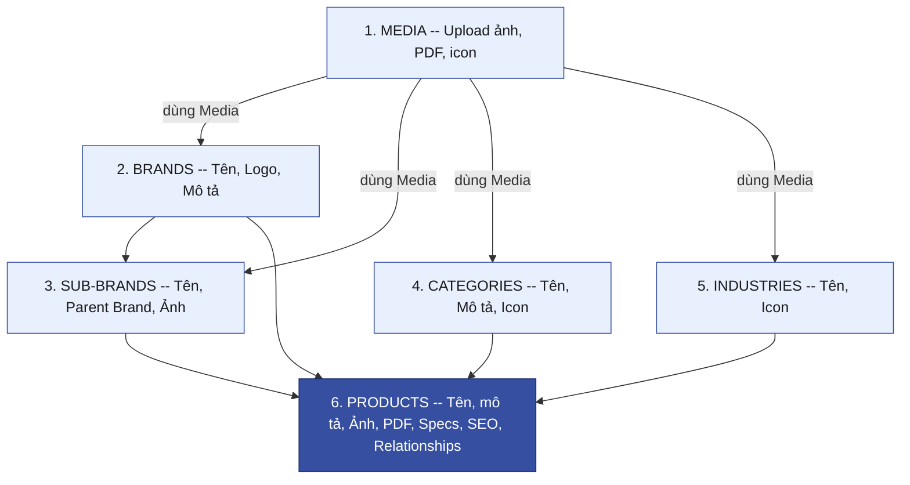

**Thứ tự nhập:** Media (1) → Brands (2) → SubBrands (3) → Categories (4) → Industries (5) → Products (6)

> Media cần được upload trước vì tất cả collection khác đều reference tới. Products nhập cuối cùng vì cần tất cả 1–5 trước.

---

## Quan hệ giữa các Collection

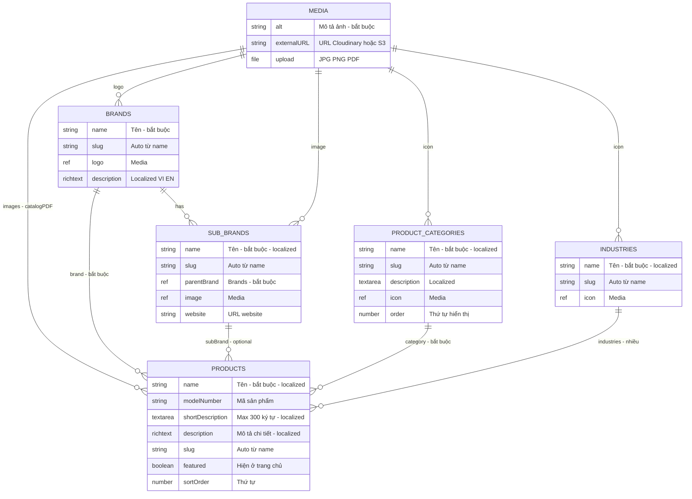

---

## Dataset tối thiểu để test

| Collection   | Số lượng    | Mục đích test                             |
| ------------ | ----------- | ----------------------------------------- |
| Media        | 10–15 files | Ảnh sản phẩm, logo, PDF                   |
| Brands       | 2–3         | Filter theo thương hiệu                   |
| SubBrands    | 1–2         | Hiển thị thương hiệu con                  |
| Categories   | 2–3         | Filter theo danh mục                      |
| Industries   | 2–3         | Filter theo ngành                         |
| **Products** | **>= 10**   | Search, sort, **pagination** (9 SP/trang) |

---

## Bước 1 — Upload Media

**Sidebar → Media → Create New**

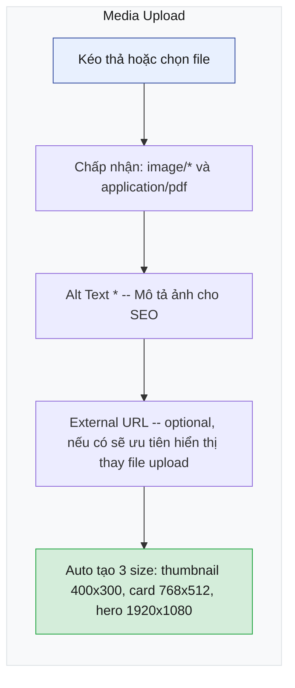

### Cần upload gì?

| Loại             | Số lượng       | Format   | Ghi chú                 |
| ---------------- | -------------- | -------- | ----------------------- |
| Ảnh sản phẩm     | 1–3 / sản phẩm | JPG, PNG | Nền trắng hoặc studio   |
| Logo thương hiệu | 1 / brand      | PNG      | Nền trong suốt tốt nhất |
| File catalog     | 0–1 / sản phẩm | PDF      | Tài liệu kỹ thuật       |
| Icon danh mục    | 0–1 / category | PNG, SVG | Optional                |
| Icon ngành       | 0–1 / industry | PNG, SVG | Optional                |

---

## Bước 2 — Tạo Brands (Thương hiệu)

**Sidebar → Taxonomies → Brands → Create New**

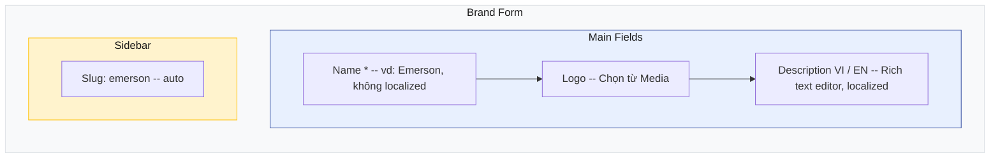

### Ví dụ data

| Name      | Logo               | Description (VI)                                  |
| --------- | ------------------ | ------------------------------------------------- |
| Emerson   | emerson-logo.png   | Tập đoàn công nghệ toàn cầu chuyên về tự động hóa |
| Honeywell | honeywell-logo.png | Nhà cung cấp giải pháp công nghệ đa ngành         |
| Siemens   | siemens-logo.png   | Tập đoàn công nghệ hàng đầu châu Âu               |

---

## Bước 3 — Tạo SubBrands (Thương hiệu con) — Optional

**Sidebar → Taxonomies → Sub Brands → Create New**

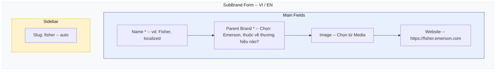

### Ví dụ data

| Name      | Parent Brand | Website                                                        |
| --------- | ------------ | -------------------------------------------------------------- |
| Fisher    | Emerson      | [https://fisher.emerson.com](https://fisher.emerson.com)       |
| Rosemount | Emerson      | [https://rosemount.emerson.com](https://rosemount.emerson.com) |

/

## Bước 4 — Tạo Product Categories (Danh mục)

**Sidebar → Taxonomies → Product Categories → Create New**

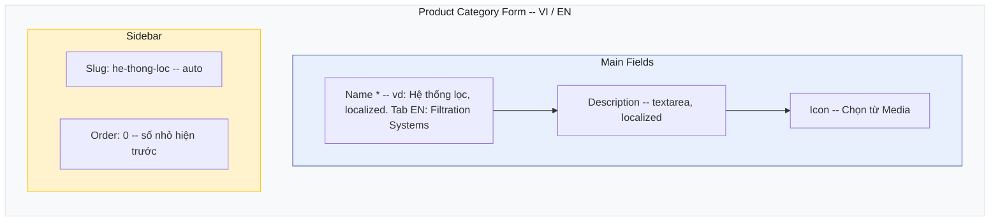

### Ví dụ data

| Name (VI)         | Name (EN)               | Order |
| ----------------- | ----------------------- | ----- |
| Hệ thống lọc      | Filtration Systems      | 0     |
| Van công nghiệp   | Industrial Valves       | 1     |
| Thiết bị đo lường | Measurement Instruments | 2     |

---

## Bước 5 — Tạo Industries (Ngành công nghiệp)

**Sidebar → Taxonomies → Industries → Create New**

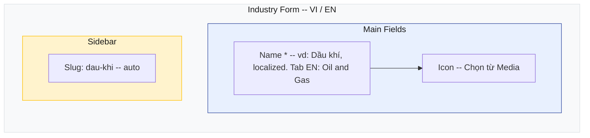

### Ví dụ data

| Name (VI)  | Name (EN) |
| ---------- | --------- |
| Dầu khí    | Oil & Gas |
| Năng lượng | Energy    |
| Hóa chất   | Chemical  |

---

## Bước 6 — Tạo Products (Sản phẩm)

**Sidebar → Content → Products → Create New**

### Tổng quan giao diện — 5 tabs + sidebar

```mermaid
flowchart LR
    subgraph tabs["Product Form -- 5 Tabs"]
        direction TB
        T1["Tab 1: Basic Info -- Name, Model, Short Desc, Description"]
        T2["Tab 2: Media -- Images, Catalog PDF"]
        T3["Tab 3: Specifications -- Label / Value / Unit"]
        T4["Tab 4: Relationships -- Brand, SubBrand, Category, Industries"]
        T5["Tab 5: SEO -- Meta Title, Meta Description"]
    end

    subgraph sidebar["Sidebar"]
        slug["Slug -- auto"]
        feat["Featured -- checkbox"]
        sort["Sort Order: 0"]
        draft["Save Draft"]
        pub["PUBLISH"]
    end

    tabs --- sidebar

    style tabs fill:#f8f9fa,stroke:#364fa1,color:#1a1a1a
    style sidebar fill:#fff3cd,stroke:#ffc107,color:#1a1a1a
    style pub fill:#364fa1,stroke:#1a2d6d,color:#fff
```

> **QUAN TRỌNG:** Phải bấm **Publish** — Draft sẽ KHÔNG hiển thị trên frontend.

### Tab 1 — Basic Info

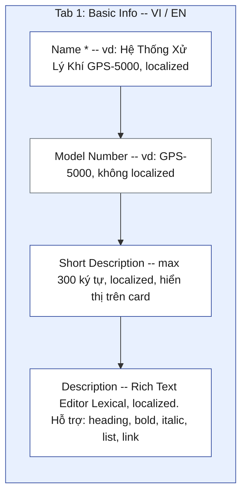

### Tab 2 — Media

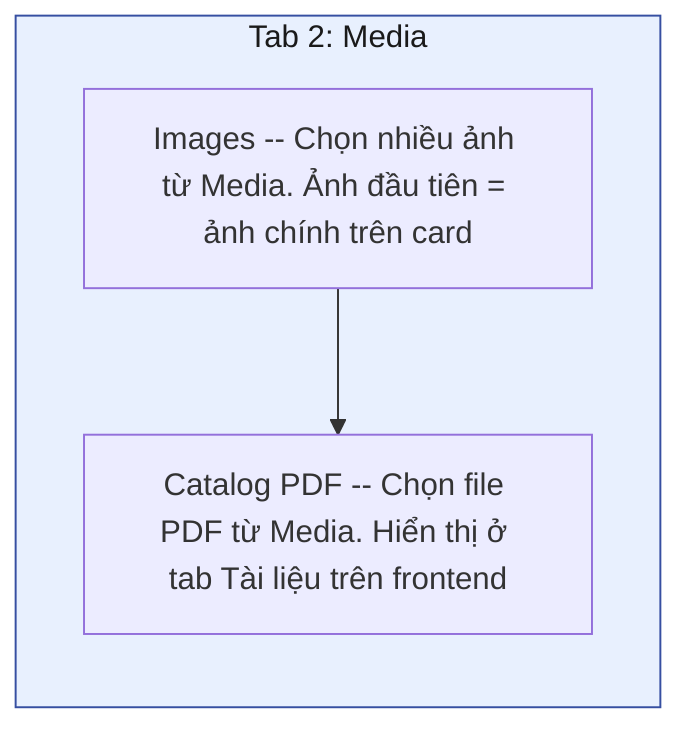

### Tab 3 — Specifications

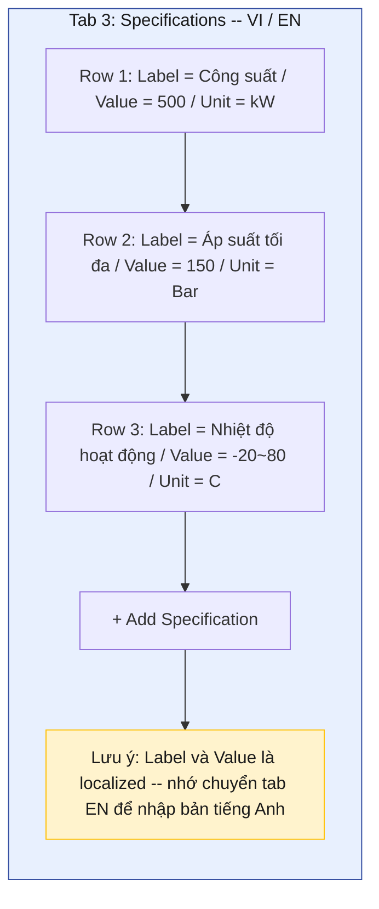

### Tab 4 — Relationships

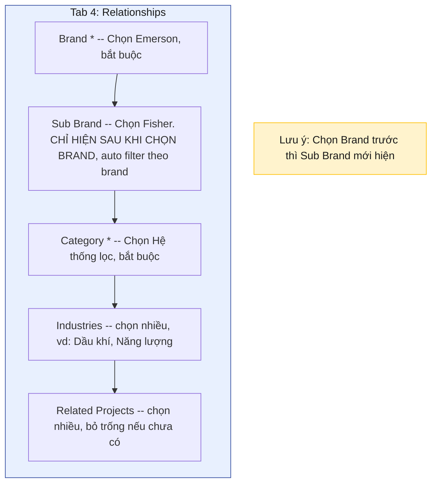

### Tab 5 — SEO (Optional)

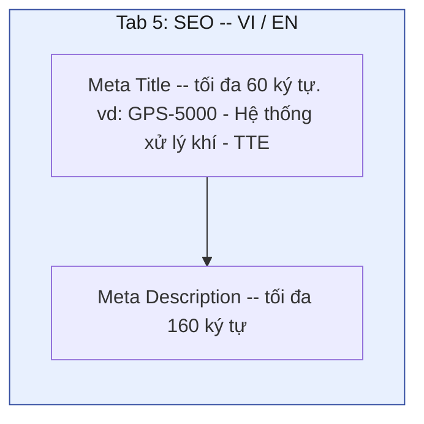

---

## Bước 7 — Localization (Song ngữ)

Các field có **localized** sẽ hiển thị tab chuyển ngôn ngữ:

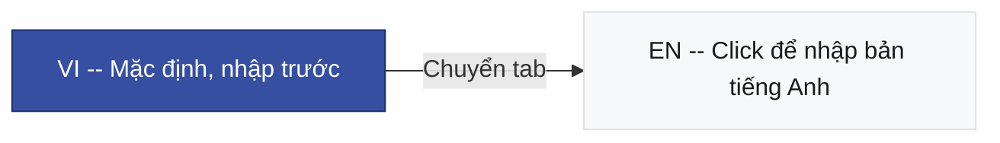

### Các field cần nhập song ngữ

| Collection | Fields localized                                                              |
| ---------- | ----------------------------------------------------------------------------- |
| Products   | name, shortDescription, description, specifications (label, value, unit), SEO |
| SubBrands  | name, description                                                             |
| Categories | name, description                                                             |
| Industries | name                                                                          |
| Brands     | description (name KHÔNG localized)                                            |

> **Lưu ý:** Nếu chưa nhập bản EN, CMS sẽ tự **fallback về VI**. Nhưng nên nhập cả 2 để hiển thị chính xác.

---

## Bước 8 — Publish và Kiểm tra

### 8.1 Publish sản phẩm

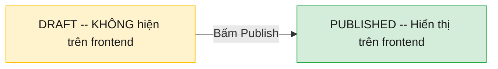

> Bấm **Publish** (không phải Save Draft) ở sidebar mỗi sản phẩm.

### 8.2 Kiểm tra API

Mở trình duyệt, truy cập các URL sau:

| Dữ liệu       | URL                                                    |
| ------------- | ------------------------------------------------------ |
| Sản phẩm (VI) | `http://localhost:4001/api/products?depth=2&locale=vi` |
| Sản phẩm (EN) | `http://localhost:4001/api/products?depth=2&locale=en` |
| Thương hiệu   | `http://localhost:4001/api/brands?depth=1`             |
| Danh mục      | `http://localhost:4001/api/product-categories`         |
| Ngành         | `http://localhost:4001/api/industries`                 |
| Sub-brands    | `http://localhost:4001/api/sub-brands?depth=1`         |

### 8.3 Kiểm tra Frontend

**Yêu cầu trước khi test:**

| Điều kiện    | Lệnh / Giá trị                                         |
| ------------ | ------------------------------------------------------ |
| Env variable | `NEXT_PUBLIC_USE_CMS=true` trong `apps/web/.env.local` |
| CMS chạy     | `make dev-cms` (port 4001)                             |
| Web chạy     | `make dev-web` (port 4000)                             |

**URL test:**

| Trang        | URL                                        |
| ------------ | ------------------------------------------ |
| Danh sách SP | `http://localhost:4000/vi/products`        |
| Chi tiết SP  | `http://localhost:4000/vi/products/{slug}` |

### 8.4 Checklist kiểm tra trên Frontend

#### Trang danh sách (`/vi/products`)

- Hiển thị đúng số sản phẩm
- Ảnh sản phẩm load đúng
- Tên, model number, mô tả ngắn hiển thị
- Badge thương hiệu, danh mục hiển thị
- Search — gõ tên/model, filter đúng
- Sort — sắp xếp A-Z, Z-A, mới nhất
- Filter sidebar — chọn brand/category/industry
- Pagination — chuyển trang khi > 9 SP
- Breadcrumb — Trang chủ > Sản phẩm

#### Trang chi tiết (`/vi/products/{slug}`)

- Ảnh gallery + thumbnail
- Tên, model, mô tả ngắn
- Badge brand + category + industries
- Tab Mô tả — rich text render đúng
- Tab Thông số — bảng spec hiển thị
- Tab Tài liệu — link PDF download
- Breadcrumb — Trang chủ > Sản phẩm > Tên SP

#### Chuyển ngôn ngữ

- `/en/products` hiển thị bản tiếng Anh
- Fallback về VI nếu chưa nhập EN

---

## Ví dụ Dataset mẫu

Dưới đây là bộ dữ liệu mẫu đủ để test tất cả tính năng:

### Brands (3)

| #   | Name      | Logo               |
| --- | --------- | ------------------ |
| 1   | Emerson   | emerson-logo.png   |
| 2   | Honeywell | honeywell-logo.png |
| 3   | Siemens   | siemens-logo.png   |

### SubBrands (2)

| #   | Name      | Parent Brand |
| --- | --------- | ------------ |
| 1   | Fisher    | Emerson      |
| 2   | Rosemount | Emerson      |

### Categories (3)

| #   | Name (VI)         | Name (EN)               | Order |
| --- | ----------------- | ----------------------- | ----- |
| 1   | Hệ thống lọc      | Filtration Systems      | 0     |
| 2   | Van công nghiệp   | Industrial Valves       | 1     |
| 3   | Thiết bị đo lường | Measurement Instruments | 2     |

### Industries (3)

| #   | Name (VI)  | Name (EN) |
| --- | ---------- | --------- |
| 1   | Dầu khí    | Oil & Gas |
| 2   | Năng lượng | Energy    |
| 3   | Hóa chất   | Chemical  |

### Products (12 — đủ test pagination 2 trang)

| #   | Name (VI)                     | Model           | Brand     | Category          | Industries           |
| --- | ----------------------------- | --------------- | --------- | ----------------- | -------------------- |
| 1   | Hệ Thống Xử Lý Khí            | GPS-5000        | Emerson   | Hệ thống lọc      | Dầu khí, Năng lượng  |
| 2   | Van Điều Khiển Tuyến Tính     | Fisher DVC-2000 | Emerson   | Van công nghiệp   | Dầu khí              |
| 3   | Bộ Đo Lưu Lượng Siêu Âm       | USM-3000        | Emerson   | Thiết bị đo lường | Dầu khí, Hóa chất    |
| 4   | Hệ Thống Lọc Dầu Thuỷ Lực     | HFS-200         | Honeywell | Hệ thống lọc      | Năng lượng           |
| 5   | Van An Toàn Áp Suất Cao       | PSV-4500        | Honeywell | Van công nghiệp   | Dầu khí, Hóa chất    |
| 6   | Cảm Biến Nhiệt Độ Công Nghiệp | TMP-900         | Honeywell | Thiết bị đo lường | Năng lượng           |
| 7   | Bộ Lọc Khí Nén Công Nghiệp    | CAF-1200        | Siemens   | Hệ thống lọc      | Hóa chất             |
| 8   | Van Bướm Điều Khiển Điện      | EBV-600         | Siemens   | Van công nghiệp   | Năng lượng, Hóa chất |
| 9   | Đồng Hồ Đo Áp Suất Số         | DPG-350         | Siemens   | Thiết bị đo lường | Dầu khí              |
| 10  | Hệ Thống Tách Dầu Nước        | OWS-800         | Emerson   | Hệ thống lọc      | Dầu khí              |
| 11  | Van Cổng Công Nghiệp          | GTV-1500        | Honeywell | Van công nghiệp   | Dầu khí, Năng lượng  |
| 12  | Bộ Phân Tích Khí Online       | OGA-250         | Siemens   | Thiết bị đo lường | Hóa chất, Năng lượng |

> **Kết quả:** 12 sản phẩm, trang 1 hiện 9, trang 2 hiện 3. Mỗi brand 4 SP, mỗi category 4 SP — filter hiển thị đều.

---

## Troubleshooting

| Vấn đề                      | Nguyên nhân                             | Cách fix                                     |
| --------------------------- | --------------------------------------- | -------------------------------------------- |
| Không thấy SP trên frontend | Chưa Publish                            | Vào CMS, Publish sản phẩm                    |
| Ảnh không hiển thị          | Media chưa upload hoặc external URL sai | Kiểm tra Media entry                         |
| Sub Brand không hiện        | Chưa chọn Brand trước                   | Chọn Brand ở tab Relationships trước         |
| API trả về `[]` rỗng        | Sai locale hoặc chưa có data            | Thử `?locale=vi` hoặc bỏ param locale        |
| Frontend hiện static data   | `NEXT_PUBLIC_USE_CMS` chưa set          | Thêm `=true` vào `apps/web/.env.local`       |
| Rich text hiện raw JSON     | Transform layer lỗi                     | Kiểm tra `transforms.ts` — `lexicalToHtml()` |

